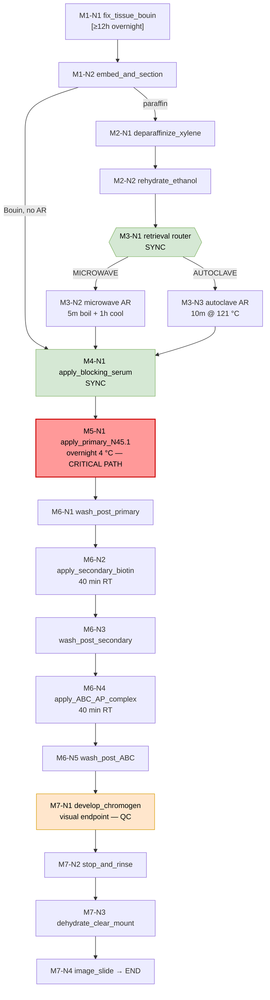

# 8-OHdG Immunohistochemistry — Lab Automation Operation File

> Generated per `labauto_prompt.md` specification.
> Source protocol: JaICA OXIDATIVE STRESS PROTOCOLS — Immunohistochemical detection of 8-OHdG / 8-oxo-dG (Rev.080611).
> Modeling paradigm: discrete-event systems + MES-style orchestration + TCMB-constrained execution planning.

---

## 0. METADATA

| Field | Value |
|---|---|
| operation_id | IHC-8OHdG-N45.1-v080611 |
| operation_class | immunohistochemistry_staining |
| assay_target | 8-OHdG / 8-oxo-dG |
| primary_antibody | anti-8-OHdG mAb clone N45.1 (1–10 µg/mL) |
| detection_method | ABC-AP (avidin-biotin-alkaline phosphatase complex) |
| chromogen | BCIP/NBT (black substrate, alkaline phosphatase) |
| sample_matrix | tissue sections (formalin-fixed paraffin-embedded OR Bouin's-fixed) |
| fixation_branches | Bouin's (overnight) / formalin + antigen retrieval |
| retrieval_branches | microwave (citrate pH 6.0) / autoclave (121 °C, 10 min) |
| detection_chain | primary → biotinylated secondary (rabbit anti-mouse IgG 1:300) → ABC-AP (1:100) → BCIP/NBT |
| total_modules | 7 |
| total_operation_nodes | 18 |
| critical_path_duration | ≈ 27.5 h (overnight primary antibody incubation dominant) |
| biosafety_level | BSL-1 / chemical hazard (picric acid, xylene, methanol) |
| reusable_resource_lanes | 6 |
| qc_checkpoints | 9 |
| synchronization_barriers | 4 |
| model_version | 1.0 |
| generated_by | labauto_prompt.md transform engine |

### 0.1 Reagent & Consumable Register
| id | reagent | role | critical_param |
|---|---|---|---|
| R-Bouin | Bouin's Solution (picric acid : formaldehyde : acetic acid : H2O = 15:5:1:10) | fixative | overnight, quantitative reproducibility |
| R-Citrate | 10 mM citrate buffer pH 6.0 | antigen retrieval medium | pH 6.0 strict |
| R-Xylene | Xylene | deparaffinization | — |
| R-EtOH | Ethanol gradient | deparaffinization / rehydration | — |
| R-BlockSerum | normal rabbit serum 1:75 (DAKO) | blocking | must match secondary antibody host species |
| R-1ary | N45.1 mAb 1–10 µg/mL | primary antibody | 4 °C overnight |
| R-2ary | biotin-labeled rabbit anti-mouse IgG 1:300 (Dako) | secondary | 40 min RT |
| R-ABC | avidin-biotin-alkaline phosphatase complex 1:100 (Vector) | signal amplification | 40 min RT |
| R-Sub | BCIP/NBT black substrate kit (Vector) | chromogenic development | AP-specific |

---

## 1. EXPERIMENT MODULAR DECOMPOSITION

### MODULE 1: FIXATION & SAMPLE PREPARATION
**Responsibility:** Stabilize tissue antigenicity; produce sectioned slides ready for IHC chain.

| Node ID | Function | Input State | Output State | Duration | Required Resource | Blocking | Sync Condition | QC Trigger | Upstream | Downstream |
|---|---|---|---|---|---|---|---|---|---|---|
| M1-N1 | `fix_tissue_bouin(fresh_tissue, bouin_solution)` | fresh tissue | Bouin-fixed tissue block | ≥12 h (overnight) | Fixation station / fume hood | blocking | — | Fixation uniformity; same-fixation rule for quantitative sets | operator | M1-N2 |
| M1-N2 | `embed_and_section(block, slide)` | fixed block | mounted sections on slides | 0.5 h | Microtome workstation | blocking | M1-N1 done | Section thickness uniformity | M1-N1 | M2-N1 (paraffin branch) / M3-N1 (Bouin skip-AR branch) |

### MODULE 2: DEPARAFFINIZATION (conditional — paraffin-embedded only)
**Responsibility:** Remove embedding medium; rehydrate tissue.

| Node ID | Function | Input State | Output State | Duration | Required Resource | Blocking | Sync Condition | QC Trigger | Upstream | Downstream |
|---|---|---|---|---|---|---|---|---|---|---|
| M2-N1 | `deparaffinize_xylene(slide)` | paraffin slide | xylene-cleared slide | 2 × 5 min | Xylene station / fume hood | blocking | M1-N2 AND paraffin_branch==TRUE | Xylene clarity (no wax residue) | M1-N2 | M2-N2 |
| M2-N2 | `rehydrate_ethanol_gradient(slide)` | xylene-cleared slide | rehydrated aqueous slide | 3 × 3 min | Ethanol gradient station | blocking | M2-N1 done | Rehydration uniformity | M2-N1 | M3-N1 |

### MODULE 3: ANTIGEN RETRIEVAL (conditional — formalin-fixed branch)
**Responsibility:** Unmask 8-OHdG epitope; bypass for Bouin's-fixed tissue.

| Node ID | Function | Input State | Output State | Duration | Required Resource | Blocking | Sync Condition | QC Trigger | Upstream | Downstream |
|---|---|---|---|---|---|---|---|---|---|---|
| M3-N1 | `select_retrieval_branch(fixation_type)` | rehydrated slide | retrieval routing decision | 0 h | logic router | non-blocking | M2-N2 OR M1-N2 (Bouin) | — | M2-N2 / M1-N2 | M3-N2 / M4-N1 |
| M3-N2 | `microwave_retrieve(slide, citrate_buffer)` | rehydrated slide | epitope-unmasked slide | 5 min boil + 1 h cool | Microwave AR station, 500 mL glass beaker, 10 mM citrate pH 6.0 | blocking | retrieval_branch==MICROWAVE | Slide integrity (tissue not detached); buffer volume maintained | M3-N1 | M4-N1 |
| M3-N3 | `autoclave_retrieve(slide)` | rehydrated slide | epitope-unmasked slide | 10 min @ 121 °C | Autoclave AR station | blocking | retrieval_branch==AUTOCLAVE | Pressure/temperature curve logged; tissue adherence | M3-N1 | M4-N1 |

### MODULE 4: BLOCKING
**Responsibility:** Suppress non-specific secondary antibody binding.

| Node ID | Function | Input State | Output State | Duration | Required Resource | Blocking | Sync Condition | QC Trigger | Upstream | Downstream |
|---|---|---|---|---|---|---|---|---|---|---|
| M4-N1 | `apply_blocking_serum(slide, normal_rabbit_serum_1_75)` | unmasked slide | serum-blocked slide | per protocol (apply & incubate) | Humidity chamber / pipettor | blocking | retrieval done OR Bouin branch reached | Serum host species matches secondary antibody host; mouse tissue → internal IgG blocking required | M3-N2 / M3-N3 / M1-N2 (Bouin) | M5-N1 |

### MODULE 5: PRIMARY ANTIBODY INCUBATION
**Responsibility:** Bind N45.1 to 8-OHdG epitopes.

| Node ID | Function | Input State | Output State | Duration | Required Resource | Blocking | Sync Condition | QC Trigger | Upstream | Downstream |
|---|---|---|---|---|---|---|---|---|---|---|
| M5-N1 | `apply_primary_N45.1(blocked_slide, antibody_1_10_ug_mL)` | blocked slide | primary-Ab-bound slide | overnight @ 4 °C | 4 °C incubator / humidity chamber | blocking | M4-N1 done | Antibody concentration log; 4 °C temperature log; negative control slide included | M4-N1 | M6-N1 |

### MODULE 6: SECONDARY ANTIBODY + SIGNAL AMPLIFICATION (ABC-AP)
**Responsibility:** Deliver biotinylated secondary and ABC-AP complex sequentially.

| Node ID | Function | Input State | Output State | Duration | Required Resource | Blocking | Sync Condition | QC Trigger | Upstream | Downstream |
|---|---|---|---|---|---|---|---|---|---|---|
| M6-N1 | `wash_post_primary(slide, buffer)` | primary-bound slide | washed slide | 3 × 5 min | Wash station | blocking | M5-N1 done | No carryover; buffer fresh | M5-N1 | M6-N2 |
| M6-N2 | `apply_secondary_biotin(slide, rabbit_anti_mouse_IgG_1_300)` | washed slide | secondary-bound slide | 40 min @ RT | Humidity chamber, RT bench | blocking | M6-N1 done | RT range 20–25 °C; coverage uniform | M6-N1 | M6-N3 |
| M6-N3 | `wash_post_secondary(slide, buffer)` | secondary-bound slide | washed slide | 3 × 5 min | Wash station | blocking | M6-N2 done | Buffer freshness | M6-N2 | M6-N4 |
| M6-N4 | `apply_ABC_AP_complex(slide, ABC_1_100)` | washed slide | ABC-AP-bound slide | 40 min @ RT | Humidity chamber, RT bench | blocking | M6-N3 done | Complex freshness (prepare ≤30 min before use); RT range | M6-N3 | M6-N5 |
| M6-N5 | `wash_post_ABC(slide, buffer)` | ABC-bound slide | washed slide | 3 × 5 min | Wash station | blocking | M6-N4 done | No residual complex | M6-N4 | M7-N1 |

### MODULE 7: CHROMOGEN DEVELOPMENT & READOUT
**Responsibility:** Develop black BCIP/NBT precipitate; acquire imaging data.

| Node ID | Function | Input State | Output State | Duration | Required Resource | Blocking | Sync Condition | QC Trigger | Upstream | Downstream |
|---|---|---|---|---|---|---|---|---|---|---|
| M7-N1 | `develop_chromogen(slide, BCIP_NBT_substrate)` | ABC-AP-bound slide | developed slide (black precipitate) | monitor under microscope | Staining station / brightfield microscope | blocking | M6-N5 done | Signal-to-noise vs negative control; no overdevelopment | M6-N5 | M7-N2 |
| M7-N2 | `stop_and_rinse(slide, water)` | developed slide | stopped slide | 2 min | Rinse station | blocking | M7-N1 endpoint reached | Clean background | M7-N1 | M7-N3 |
| M7-N3 | `dehydrate_clear_mount(slide, ethanol_xylene_mountant)` | stopped slide | mounted permanent slide | 10 min | Dehydration / mounting station | blocking | M7-N2 done | No trapped air; coverslip sealed | M7-N2 | M7-N4 |
| M7-N4 | `image_slide(mounted_slide, microscope, camera)` | mounted slide | digital image + scoring record | 5–10 min | Whole-slide scanner / brightfield scope + camera | non-blocking (image archive) | M7-N3 done | Focus, exposure, scale bar; scorer blinded | M7-N3 | END |

**Aggregate Data Flow:**
`Fresh Tissue → Fixed Block → Sections → (Deparaffinized) → (Retrieved) → Blocked → Primary-bound → Washed → Secondary-bound → Washed → ABC-AP-bound → Washed → Developed → Mounted → Image + Score`

---

## 2. RESOURCE MAPPING TABLE

| Lane ID | Resource | Type | Capacity | Reusable | Persistence | Contention Risk | Notes |
|---|---|---|---|---|---|---|---|
| L-FIX | Fixation station / fume hood | instrument | 1 batch | yes | persistent | low | Picric acid hazard; overnight occupancy |
| L-MICRO | Microtome workstation | instrument | 1 slide set | yes | persistent | medium | Operator-bound |
| L-DEP | Xylene / ethanol deparaffinization station | instrument | 1 batch | yes | persistent | medium | Chemical waste handling |
| L-AR-MW | Microwave AR station + 500 mL beaker | instrument | 1 batch | yes | persistent | high | Single batch; long cooldown |
| L-AR-AC | Autoclave AR station | instrument | 1 batch | yes | persistent | high | Pressure vessel scheduling |
| L-INC-4C | 4 °C incubator / humidity chamber | instrument | multi-slide | yes | persistent | high | Overnight occupancy; shared across batches |
| L-RT-BENCH | RT humidity chamber / bench | instrument | multi-slide | yes | persistent | high | Stages M4, M6-N2, M6-N4 share |
| L-WASH | Wash station / buffer troughs | instrument | multi-slide | yes | persistent | medium | Reused at M6-N1/N3/N5 |
| L-STAIN | Staining station + brightfield scope | instrument | 1 slide | yes | persistent | high | Endpoint determined visually |
| L-MOUNT | Dehydration / mounting station | instrument | 1 batch | yes | persistent | medium | Xylene final step |
| L-IMG | Whole-slide scanner / camera scope | instrument | 1 slide queue | yes | persistent | medium | Imaging queue |
| OP-TECH | Histotechnician | operator | 1 | no | persistent | HIGH | Bottleneck — single human thread |
| REAG-BLOCK | Blocking serum aliquot | consumable | batch-limited | no | transient | low | Discard after use |
| REAG-1ARY | N45.1 antibody aliquot | consumable | batch-limited | no | transient | medium | Cold chain |
| REAG-2ARY | Biotinylated secondary aliquot | consumable | batch-limited | no | transient | low | — |
| REAG-ABC | ABC-AP complex aliquot | consumable | batch-limited | no | transient | medium | Must be freshly prepared ≤30 min |
| REAG-SUB | BCIP/NBT substrate kit | consumable | batch-limited | no | transient | medium | Light-sensitive |

---

## 3. TCMB (TIME CONSTRAINTS BY MUTUAL BOUNDARIES) MATRIX

> Notation: `[t_min, t_max]` between predecessor-end and successor-start. `inf` = no upper bound. `SYNC` = barrier; `*` = coupled (shared bound).

| From | To | Constraint (h:min) | Type | Rationale |
|---|---|---|---|---|
| M1-N1 end | M1-N2 start | [0:00, 2:00] | min/max | Avoid over-fixation artifacts |
| M1-N1 end | M1-N1 end (other samples in quantitative set) | [SYNC, SYNC] | barrier | All samples fixed identically for quantitative comparability |
| M2-N1 end | M2-N2 start | [0:00, 0:30] | min/max | Prevent air-dry artifacts |
| M2-N2 end | M3-N2/N3 start | [0:00, 0:30] | min/max | Tissue must stay hydrated |
| M3-N2 end (microwave boil) | M3-N2 cool end | [1:00, 1:30] | coupled* | Slow cool mandated by protocol |
| M3-N3 autoclave dwell | 10:00 strict | coupled* | Process parameter |
| M3-N2/N3 end | M4-N1 start | [0:00, 1:00] | min/max | Epitope stability window |
| M4-N1 end | M5-N1 start | [0:00, 0:30] | min/max | Blocking efficacy decays |
| M5-N1 start | M5-N1 end | [12:00, 18:00] | coupled* | Overnight @ 4 °C; min 12 h, avoid >18 h |
| M5-N1 end | M6-N1 start | [0:00, 0:30] | min/max | Bound antibody stability |
| M6-N1 wash dwell | 3 × 5:00 strict | coupled* | Wash stringency |
| M6-N2 secondary | 0:40 strict @ RT | coupled* | Protocol fixed |
| M6-N3 wash | 3 × 5:00 strict | coupled* | Wash stringency |
| M6-N4 ABC-AP | 0:40 strict @ RT | coupled* | Protocol fixed |
| REAG-ABC ready | M6-N4 start | [0:00, 0:30] | max | Complex freshness |
| M6-N5 wash | 3 × 5:00 strict | coupled* | Wash stringency |
| M6-N5 end | M7-N1 start | [0:00, 0:15] | max | Enzyme activity window |
| M7-N1 develop | [0:02, 0:20] visual endpoint | coupled* | Operator-judgment bound |
| M7-N1 end | M7-N2 start | [0:00, 0:05] | max | Stop reaction immediately |
| M7-N3 end | M7-N4 start | [0:00, inf] | — | Permanent slide storable |

---

## 4. OPERATION DAG (DIRECTED ACYCLIC GRAPH)



Edges = strict precedence (data + state dependencies). Red node = critical path; orange = QC checkpoint; green = synchronization barrier.

---

## 5. INSTRUMENT-LANE OPERATION DIAGRAM

```
Legend:  [L-lane]  H=Human op  A=Automatable  ◇=QC  ║=Sync barrier  ▒=wait/idle  ►=active
         Reuse of same lane across modules is enforced by horizontal lane persistence.

Time axis (compressed, log-style):  T0 ---------- T+12h ---------- T+24h ---------- T+27h ---------- END
                                     (overnight fixation)  (overnight 1°Ab)   (dev/imaging)

L-FIX      │ M1-N1 H fix_tissue_bouin ║overnight▒▒▒▒▒▒▒▒▒▒▒▒▒▒▒▒▒▒▒▒▒ │                          │
L-MICRO    │                          │ M1-N2 H section ▒│            │                          │
L-DEP      │                          │                  │ M2-N1 H xylene │ M2-N2 H EtOH │        │
L-AR-MW    │                          │                  │                │ M3-N2 H MW retrieve+cool │
L-AR-AC    │                          │                  │                │ (alt) M3-N3 H autoclave  │
L-WASH     │                          │                  │                │                │ M6-N1►M6-N3►M6-N5 (reuse) │
L-RT-BENCH │                          │                  │                │ M4-N1 H block │ M6-N2 H 2°Ab │ M6-N4 H ABC-AP │
L-INC-4C   │                          │                  │                │                │ M5-N1 H/A 1°Ab overnight ◇4°C ║overnight▒▒▒▒ │
L-STAIN    │                          │                  │                │                │                                  │ M7-N1 H develop ◇endpoint │
L-MOUNT    │                          │                  │                │                │                                  │                │ M7-N2►M7-N3 H │
L-IMG      │                          │                  │                │                │                                  │                │                │ M7-N4 A scan │
OP-TECH    │ ●════════════════════════════════════════════════════════════════════════════════════════════════════════════════ (single human thread — BOTTLENECK)
           │ T0                                          T+12h                                  T+24h                                T+27h         END

QC checkpoints: ◇ M1 (fixation uniformity) | ◇ M2 (no wax) | ◇ M3 (slide integrity) | ◇ M4 (serum species match) | ◇ M5 (1°Ab conc + 4°C + neg ctrl) | ◇ M6 (RT + ABC freshness) | ◇ M7-N1 (S/N endpoint) | ◇ M7-N3 (mount integrity) | ◇ M7-N4 (image QC)
Sync barriers:  ║ S1 quantitative set fixation | ║ S2 retrieval router decision | ║ S3 overnight 1°Ab incubation | ║ S4 development endpoint judgment

Reuse map (lane persistence):
  • L-WASH reused at M6-N1, M6-N3, M6-N5  (3 sequential occupations; non-overlapping)
  • L-RT-BENCH reused at M4-N1, M6-N2, M6-N4
  • L-INC-4C occupied overnight by M5-N1 (blocks other 4 °C jobs on same chamber)
  • OP-TECH reused at every H node (serial human queue)
```

---

## 6. AUTOMATION SCHEDULING LOGIC

```
scheduler_policy:
  paradigm: discrete_event_simulation + greedy_lane_allocation
  human_op_class: [M1-N1, M1-N2, M2-N1, M2-N2, M3-N2, M3-N3, M4-N1, M6-N2, M6-N4, M7-N1, M7-N2, M7-N3]
  automatable_class: [M5-N1 (4°C chamber), M6 washes (washer module), M7-N4 (scanner)]
  serialization_rule:
    - OP-TECH is a single-server FIFO queue; cannot parallelize H nodes
    - All H nodes are blocking w.r.t. OP-TECH
  lane_lock_protocol:
    - L-INC-4C acquires lock at M5-N1 start, releases at M5-N1 end (overnight hold)
    - L-AR-MW and L-AR-AC are mutex per batch (one batch per AR cycle)
    - L-WASH allocations are non-overlapping by time slicing
  retrieval_branch_selection:
    rule: IF fixation_type==Bouin THEN skip M3 entirely (route M1-N2 → M4-N1)
          ELIF paraffin_branch==TRUE AND AR_required==TRUE THEN dispatch M3-N2 OR M3-N3
          ELSE route M2-N2 → M4-N1
  tcmb_enforcement:
    - hard_lower_bound: enforce min durations (e.g., M5-N1 ≥ 12 h)
    - hard_upper_bound: enforce max delays (e.g., M6-N5→M7-N1 ≤ 15 min)
    - sync_barrier: wait_for(S1,S2,S3,S4) before downstream dispatch
  batch_policy:
    - Quantitative comparison sets MUST share S1 fixation batch
    - Multiple slides can share L-INC-4C overnight (parallel slide slots) but OP-TECH loading is serial
  failure_recovery:
    - If ABC complex freshness window (≤30 min) breached: discard aliquot, regenerate, re-enter M6-N4
    - If M7-N1 over-develops: restart from M6-N5 (wash) with new substrate aliquot
    - If M5-N1 4 °C breach: re-apply primary from M5-N1 with new aliquot
```

---

## 7. CRITICAL PATH ANALYSIS

Critical path (longest weighted chain through DAG):

```
M1-N1 (12 h)  →  M1-N2 (0.5 h)  →  M2-N1 (0.17 h)  →  M2-N2 (0.15 h)
   →  M3-N2 (1.17 h)  →  M4-N1 (0.5 h)  →  M5-N1 (15 h overnight, dominant)
   →  M6-N1 (0.25 h)  →  M6-N2 (0.67 h)  →  M6-N3 (0.25 h)  →  M6-N4 (0.67 h)
   →  M6-N5 (0.25 h)  →  M7-N1 (0.2 h)  →  M7-N2 (0.05 h)  →  M7-N3 (0.17 h)  →  M7-N4 (0.15 h)

Σ critical ≈ 27.5 h  (overnight fixation + overnight 1°Ab incubation = ~2× overnight barriers)
```

**Two overnight barriers dominate:** M1-N1 (fixation) and M5-N1 (primary antibody). No critical path can be shortened without violating protocol TCMB lower bounds.

### Float (slack) analysis
| Node | Slack | Notes |
|---|---|---|
| M2-N1, M2-N2 | low | Conditional branch; tight hydration window |
| M3-N3 (autoclave alt) | ≈ 0 | Mutually exclusive with M3-N2; whichever chosen is critical |
| M6-N1/N3/N5 washes | low | Coupled TCMB; no slack |
| M7-N3 | high | Mounted slide storable indefinitely |
| M7-N4 | high | Imaging non-blocking w.r.t. archive |

---

## 8. BOTTLENECK ANALYSIS

| Rank | Bottleneck | Type | Impact | Mitigation |
|---|---|---|---|---|
| 1 | **OP-TECH single human thread** | operator resource | Serializes every H node; theoretical throughput = 1 batch per ~27.5 h cycle | Parallelize across 2 technicians; automate wash steps (M6-N1/N3/N5) with a slide washer |
| 2 | **L-INC-4C overnight hold (M5-N1)** | temporal barrier | 12–18 h blocking occupancy of 4 °C chamber | Batch multiple slides per chamber; ensure chamber has slot capacity |
| 3 | **L-AR-MW cooldown (M3-N2)** | instrument contention | 1 h idle lane post-boil; no other microwave AR batches during cooldown | Stagger slide sets across multiple microwave stations; move to autoclave branch for high batch count |
| 4 | **REAG-ABC freshness ≤30 min** | consumable timing | Tight TCMB forces just-in-time prep | Prepare aliquot only after M6-N3 wash start signal; alarm at T+15 min |
| 5 | **L-STAIN visual endpoint (M7-N1)** | operator judgment | Non-deterministic duration; QC subjective | Use timed development protocol with microscope camera + image-based stop trigger |
| 6 | **Quantitative fixation sync (S1)** | synchronization barrier | All samples in a comparison set must enter M1-N1 together | Pre-schedule fixation windows; reserve L-FIX lane for the entire set |
| 7 | **Chemical waste handling (L-DEP, xylene/mountant)** | facility throughput | Bottleneck if waste collection saturated | Pre-allocate waste carboys; coordinate with EHS pickup cadence |

### Resource contention heatmap (qualitative)
```
              T0    +6h   +12h   +18h   +24h   +27h
OP-TECH       ███   ███    ███    ███    ███    █     ← sustained high
L-INC-4C      ░░░   ███    ███    ███    ░░░    ░     ← overnight block
L-WASH        ░░░   ░░░    ░░░    ░░░    █      ░     ← 3 bursts in module 6
L-RT-BENCH    ░░░   ░░░    ░░░    ░░░    ███    ░     ← 3 sequential RT steps
L-AR-MW       ░░░   ░░░    █      ░░░    ░░░    ░     ← single cooldown
L-STAIN       ░░░   ░░░    ░░░    ░░░    ░░░    █     ← visual endpoint only
```
█ = high contention   ░ = idle/low

---

## 9. STATE TRANSITION SUMMARY (sample-state machine)

```
[raw_tissue] --M1-N1--> [fixed_block] --M1-N2--> [sectioned_slide]
   |                                                       |
   | (paraffin branch)                                    (Bouin branch)
   v                                                       |
[deparaffinized_slide] --M2-N2--> [rehydrated_slide]       |
   |                                                       |
   v                                                       |
[retrieved_slide] <─── M3-N2/N3 ──── (paraffin only)        |
   |                                                       |
   +---------------------->+-------------------------------+
                           |
                           v
                  [blocked_slide] --M5-N1--> [primary_bound]
                                                  |
                                                  v
                                          [secondary_bound] --M6-N4--> [abc_ap_bound]
                                                                          |
                                                                          v
                                                                  [developed_slide]
                                                                          |
                                                                          v
                                                                  [mounted_permanent_slide]
                                                                          |
                                                                          v
                                                                  [image_record]  END
```

---

## 10. END OF OPERATION FILE

Compliance with `labauto_prompt.md`:
- ✅ Modular task nodes (Section 1)
- ✅ Instrument resource lanes (Section 5, persistent horizontal lanes)
- ✅ Operators (OP-TECH), state transitions (Section 9), data flow edges (Section 1 + DAG)
- ✅ Synchronization barriers (S1–S4)
- ✅ QC checkpoints (9 sites, all marked ◇)
- ✅ Temporal constraints (Section 3 TCMB)
- ✅ Parallel execution regions (multi-slide L-INC-4C; conditional AR branch)
- ✅ Blocking/non-blocking behavior (per-node column)
- ✅ Reusable instrument resources (L-WASH, L-RT-BENCH reused)
- ✅ TCMB modeling (min/max/coupled/sync)
- ✅ Output format: modular decomposition, resource map, TCMB matrix, DAG, lane diagram, scheduling logic, critical path, bottleneck analysis
- ✅ Terminology from discrete-event systems, manufacturing scheduling, orchestration engines, industrial automation, cyber-physical systems
