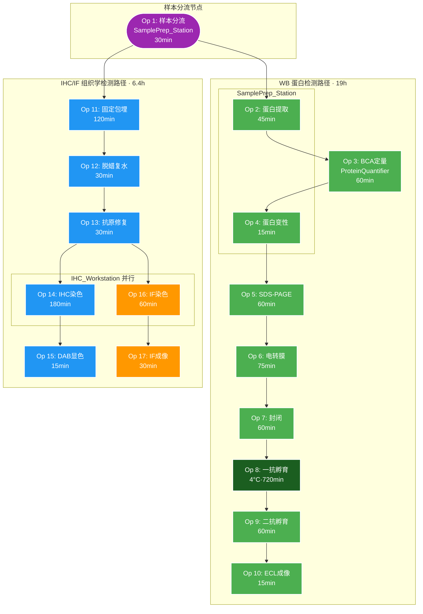

# SOP: 小鼠肠道组织焦亡检测综合实验方案

## 流程名称
小鼠肠道组织焦亡检测综合实验 —— GSDMD / Caspase-1 / NLRP3 / ASC 的 WB 与 IHC/IF 检测

## 适用场景
规划与开展自动化生物实验：放射性肠炎（RE）及 Nic 治疗模型中细胞焦亡水平的全方位评估，涵盖 Western Blot（蛋白表达与剪切检测）与 IHC/IF（组织学定位与 ASC Specks 检测）两大并行模块。

## 负责人
[待填写]

## 更新日期
2026-08-13

---

## 📑 子文档索引

本 SOP 已拆分为两个独立文档，点击链接进入：

| 模块 | 文档 | 适用场景 | 总时长 |
|:---|:---|:---|:---|
| **Western Blot** | [SOP_WesternBlot.md](file:///workspace/SOP_小鼠肠道组织焦亡检测_WesternBlot.md) | 蛋白表达与剪切检测（GSDMD/Caspase-1/NLRP3/ASC） | 19h |
| **IHC / IF** | [SOP_IHC_IF.md](file:///workspace/SOP_小鼠肠道组织焦亡检测_IHC_IF.md) | 组织学定位（NLRP3/GSDMD-N）与 ASC Specks 检测 | 6.4h |

---

## 流程总览

### 样本分流

```
小鼠处死 → 肠道组织取出
         │
         ├──→ 30-50mg 液氮速冻 ──→ Western Blot 路径
         │
         └──→ 整块组织 4% PFA 固定 ──→ IHC/IF 路径
```

### 双模块并行时间线

```
时间 (h)  0    2    4    6    8    10   12   14   16   18   20
          │    │    │    │    │    │    │    │    │    │    │
WB 路径   ■样本分离■蛋白提取■BCA■电泳■转膜■封闭■██████一抗孵育(12h)██████■二抗■ECL成像■
          0-30  31-76    76-136 136-211 211-286 286-346  346────────────1066  1066-1126 1126-1141

IHC/IF    ■固定包埋■脱蜡复水■抗原修复■IHC染色/IF染色■DAB显色■IF成像■
路径       30-150   150-180 181-211  212-392    393-454   453-483
```

---

## Lab Automation 总览

### Instrument-Lane Operation Diagram (Mermaid)



### 资源映射表

| 仪器 | 类型 | 用途 | 兼容模块 |
|:---|:---|:---|:---|
| SamplePrep_Station | 共享 | 样本处理 | WB (Op 1,2,4) |
| ProteinQuantifier | 独占 | BCA 定量 | WB (Op 3) |
| Electrophoresis_System | 独占 | SDS-PAGE | WB (Op 5) |
| Transfer_System | 独占 | 电转膜 | WB (Op 6) |
| Incubation_Station | 共享 | 封闭/二抗 | WB (Op 7,9) |
| Cold_Incubator_4C | 共享 | 4°C 孵育 | WB (Op 8) |
| ECL_Imager | 独占 | 化学发光 | WB (Op 10) |
| IHC_Workstation | 共享 | 脱蜡/修复/染色 | IHC/IF (Op 12-16) |
| Fluorescence_Microscope | 独占 | 荧光成像 | IF (Op 17) |
| Tissue_Fixation_Station | 独占 | 固定/包埋/切片 | IHC/IF (Op 11) |

### 关键路径

```
整体关键路径: WB 路径 = 19h (受限于 4°C 过夜孵育)
并行 IHC/IF 路径: 6.4h (远快于 WB，非路径瓶颈)
```

### 完整调度详情

| Op | 操作 | 仪器 | 开始(min) | 结束(min) | 时长(min) | 模块 |
|:---|:---|:---|:---|:---|:---|:---|
| 1 | 样本分流 | SamplePrep_Station | 0 | 30 | 30 | 共享 |
| 11 | 固定包埋 | Tissue_Fixation_Station | 30 | 150 | 120 | IHC/IF |
| 2 | 蛋白提取 | SamplePrep_Station | 31 | 76 | 45 | WB |
| 3 | BCA定量 | ProteinQuantifier | 76 | 136 | 60 | WB |
| 4 | 蛋白变性 | SamplePrep_Station | 136 | 151 | 15 | WB |
| 12 | 脱蜡复水 | IHC_Workstation | 150 | 180 | 30 | IHC/IF |
| 5 | SDS-PAGE | Electrophoresis_System | 151 | 211 | 60 | WB |
| 13 | 抗原修复 | IHC_Workstation | 181 | 211 | 30 | IHC/IF |
| 6 | 电转膜 | Transfer_System | 211 | 286 | 75 | WB |
| 14 | IHC染色 | IHC_Workstation | 212 | 392 | 180 | IHC |
| 7 | 封闭 | Incubation_Station | 286 | 346 | 60 | WB |
| 8 | 一抗孵育 | Cold_Incubator_4C | 346 | 1066 | 720 | WB |
| 16 | IF染色 | IHC_Workstation | 393 | 453 | 60 | IF |
| 17 | IF成像 | Fluorescence_Microscope | 453 | 483 | 30 | IF |
| 15 | DAB显色 | IHC_Workstation | 454 | 469 | 15 | IHC |
| 9 | 二抗孵育 | Incubation_Station | 1066 | 1126 | 60 | WB |
| 10 | ECL成像 | ECL_Imager | 1126 | 1141 | 15 | WB |

---

## 参考文献

1. Western blot for tissue extract. *protocols.io*.
2. Detailed Western Blotting Protocol. *protocols.io*.
3. ASC speck formation as a marker of inflammasome activation. *Nature Protocols*.
4. SLab.jl: A scheduling optimization framework for laboratory automation. [内部代码库]
5. labauto_prompt.md: Lab Automation analysis skill template. [内部文件]

---

## 相关文件

- [WB SOP](file:///workspace/SOP_小鼠肠道组织焦亡检测_WesternBlot.md) — Western Blot 模块详细 SOP
- [IHC/IF SOP](file:///workspace/SOP_小鼠肠道组织焦亡检测_IHC_IF.md) — IHC/IF 模块详细 SOP
- [交互式甘特图](file:///workspace/gantt_pyroptosis.html) — 浏览器打开查看
- [labauto_prompt.md](file:///workspace/labauto_prompt.md) — Lab Automation 分析模板
- [SLab.jl](file:///workspace/src/SLab.jl) — 调度引擎
- [仿真 case 文件](file:///workspace/examples/case_pyroptosis) — SLab.jl 输入数据