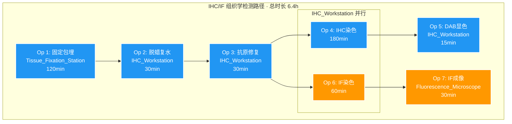

# SOP: 小鼠肠道组织焦亡检测 — IHC/IF 篇

## 流程名称
小鼠肠道组织焦亡检测 — 免疫组织化学（IHC）与免疫荧光（IF）检测

## 适用场景
放射性肠炎（RE）及 Nic 治疗模型中，通过 IHC 检测 NLRP3 与 GSDMD-N 的组织定位，通过 IF 检测 ASC Specks 的形成，全方位评估细胞焦亡的组织学特征。

## 负责人
[待填写]

## 更新日期
2026-08-13

---

## 流程步骤

### 1. 样本固定与石蜡包埋

- **触发条件**：IHC/IF 路径组织（4% PFA 固定 24h 以上）
- **动作**：
  1. 4% PFA 固定：组织块浸入 4% PFA，RT 固定 24-48h
  2. 脱水：依次 70%→85%→95%→100%→100% 乙醇各 30min
  3. 透明：二甲苯 I 20min → 二甲苯 II 20min
  4. 浸蜡：60°C 石蜡 I 30min → 石蜡 II 30min
  5. 包埋：将组织块放入包埋模具，调整方向，冷凝
  6. 切片：石蜡切片机切 4μm 厚连续切片，置于 45°C 温水中展片
  7. 捞片：将切片捞至载玻片，60°C 烘烤 30min
- **完成标准**：
  - 切片厚度均匀（4μm），无褶皱
  - 组织完整包含肠粘膜上皮
  - 每样本至少 3 张连续切片

### 2. 脱蜡与复水

- **触发条件**：石蜡切片烘烤完成
- **动作**：
  1. 二甲苯 I：5 min
  2. 二甲苯 II：5 min
  3. 100% 乙醇 I：3 min
  4. 100% 乙醇 II：3 min
  5. 95% 乙醇：3 min
  6. 85% 乙醇：3 min
  7. 70% 乙醇：3 min
  8. 水洗：2 min
- **完成标准**：切片完全脱蜡，无二甲苯残留痕迹

### 3. 抗原修复

- **触发条件**：脱蜡复水完成
- **动作**：
  1. 配制 EDTA 抗原修复液（pH 8.0）
  2. 将切片放入修复液中
  3. 微波/高压加热至 95-100°C，持续 15-20 min
  4. 自然冷却至 RT（约 20 min）
  5. 水洗 2 min
- **完成标准**：
  - 修复液温度均匀
  - 切片无脱落
  - EDTA (pH 8.0) 不可用柠檬酸盐缓冲液替代（NLRP3 抗原特性要求）

### 4. 免疫组化（IHC）染色

- **触发条件**：抗原修复完成
- **动作**：
  1. 阻断内源性过氧化物酶：3% H₂O₂ 孵育 10 min
  2. TBS-T 洗涤 3×5 min
  3. BSA 封闭：3-5% BSA (TBS-T) RT 孵育 30 min
  4. 弃封闭液，加一抗（按如下稀释），4°C 孵育过夜：
     - Anti-NLRP3 (AdipoGen)：1:1000
     - Anti-GSDMD-N (CST #96458)：1:500
  5. TBS-T 洗涤 3×5 min
  6. 加 HRP 标记二抗，RT 孵育 50 min
  7. TBS-T 洗涤 3×5 min
  8. DAB 显色：DAB 工作液 RT 孵育 3-5 min，显微镜下控制显色强度
  9. 水洗终止显色
  10. 苏木精复染 1-2 min → 水洗 → 1% 盐酸酒精分化 → 流水蓝化
  11. 脱水→透明→封片
- **完成标准**：
  - NLRP3：胞质弥漫性染色，强度显著上调 → 炎症小体启动
  - GSDMD-N：胞质/胞膜染色增强，膜破裂 → 焦亡执行
  - 对照组背景着色极弱

### 5. 免疫荧光（IF）染色 — ASC Specks 检测

- **触发条件**：抗原修复完成（与 IHC 步骤 3 并行启动）
- **动作**：
  1. BSA 封闭：3-5% BSA (TBS-T + 0.1% Triton X-100) RT 孵育 1h
  2. 弃封闭液，加 Anti-ASC 一抗 (CST #67824, 1:200)，4°C 孵育过夜
  3. TBS-T + 0.1% Triton X-100 洗涤 3×5 min
  4. 加 Alexa Fluor 488 标记二抗 (1:500)，RT 孵育 1h（避光）
  5. TBS-T 洗涤 3×5 min
  6. 水溶性封片剂封片
- **完成标准**：
  - 对照组 ASC 弥漫分布于胞质
  - 焦亡激活细胞中可见 1-2μm 强荧光斑点（ASC Specks）

### 6. 荧光显微镜成像

- **触发条件**：IF 染色完成
- **动作**：
  1. 开启荧光显微镜，选择合适滤光片（FITC/Alexa Fluor 488）
  2. 10× 镜下定位目标区域（肠粘膜上皮）
  3. 40× 镜下采集 5-10 个视野
  4. 每样本至少 3 张 40× 图像
  5. 保存原始图像，标记样本编号
- **完成标准**：
  - 图像清晰，信噪比高
  - ASC Specks 可辨
  - 每高倍视野（HPF）≥5 个 Specks 判定为焦亡激活

### 7. 结果判读

- **IHC 判定**：
  - NLRP3：胞质弥漫性染色，与对照组比较 → 炎症小体启动
  - GSDMD-N：胞质/胞膜染色增强，膜破裂 → 焦亡执行
- **IF 判定（金标准）**：
  - 正常细胞：ASC 弥漫分布于胞质
  - 焦亡激活细胞：ASC 聚集成 1-2μm 强荧光斑点（Speck）
  - 统计：每样本 5 个 HPF 中 Specks 阳性细胞比例

---

## Lab Automation 分析

### Instrument-Lane Operation Diagram (Mermaid)



### 资源映射表

| 仪器 | 类型 | 用途 | 状态 |
|:---|:---|:---|:---|
| Tissue_Fixation_Station | 独占 | 固定/脱水/包埋/切片 | 需预约 |
| IHC_Workstation | 共享 | 脱蜡/修复/IHC染色/IF染色 | 关键共享资源 |
| Fluorescence_Microscope | 独占 | IF 成像 | 需预约 |

### TCMB 时间约束

| 前驱操作 | 边界 | 后继操作 | 边界 | 最大间隔 | 原因 |
|:---|:---|:---|:---|:---|:---|
| Op 1 (固定包埋) | end | Op 2 (脱蜡复水) | start | 1440 min | 石蜡稳定期 |
| Op 3 (抗原修复) | end | Op 4 (IHC染色) | start | 60 min | 组织干燥风险 |
| Op 3 (抗原修复) | end | Op 6 (IF染色) | start | 60 min | 抗原暴露稳定性 |
| Op 4 (IHC染色) | end | Op 5 (DAB显色) | start | 30 min | 二抗结合稳定性 |

### 关键路径分析

```
固定包埋(120') → 脱蜡复水(30') → 抗原修复(30') → IHC染色(180') → DAB显色(15')
                                                      ↘ IF染色(60') → IF成像(30')
```

**IHC 路径**：375 min (6.25h)
**IF 路径**：300 min (5.0h)
**整体**：IHC 与 IF 并行，总时长 405 min (6.75h)

### 瓶颈分析

| 瓶颈 | 原因 | 缓解措施 |
|:---|:---|:---|
| IHC_Workstation | IHC/IF 共用，需串行 | IHC 与 IF 染色先后启动（间隔 5min） |
| 固定包埋 | 120min 手动操作 | 如有自动脱水机可缩短 |
| 抗原修复 | 温度/时间需精确控制 | 使用自动修复仪 |
| 荧光显微镜 | 独占资源 | 集中成像，减少调度冲突 |

---

## 材料 Metadata

### IHC/IF 专用试剂清单

| 编号 | 试剂名称 | 货号/规格 | 供应商 | 存储条件 | 用量/样本 |
|:---|:---|:---|:---|:---|:---|
| I-R1 | 4% PFA 固定液 | 500mL | - | RT | 20mL |
| I-R2 | EDTA 抗原修复液 (pH 8.0) | 500mL | - | RT | 500mL |
| I-R3 | 二甲苯 | 500mL | - | RT | 100mL |
| I-R4 | 乙醇 (70-100%) | 各 1L | - | RT | 200mL |
| I-R5 | 石蜡 | 1kg | - | 60°C | 100g |
| I-R6 | 3% H₂O₂ | 500mL | - | RT | 100μL |
| I-R7 | BSA 封闭液 | 500mL | - | 4°C | 200μL |
| I-R8 | Anti-NLRP3 | AdipoGen | AdipoGen | -20°C | 1:1000 |
| I-R9 | Anti-GSDMD-N | CST #96458 | CST | -20°C | 1:500 |
| I-R10 | Anti-ASC (IF 用) | CST #67824 | CST | -20°C | 1:200 |
| I-R11 | HRP 二抗（IHC 用） | CST #7074 | CST | -20°C | 1:3000 |
| I-R12 | Alexa Fluor 488 二抗（IF 用） | 1mg/mL | Invitrogen | -20°C | 1:500 |
| I-R13 | DAB 显色试剂盒 | 50 次 | CST | 4°C | 100μL |
| I-R14 | 苏木精复染液 | 500mL | - | RT | 200mL |
| I-R15 | 1% 盐酸酒精 | 500mL | - | RT | 50mL |
| I-R16 | 水溶性封片剂 | 50mL | - | 4°C | 10μL |
| I-R17 | 0.1% Triton X-100 (TBS-T) | 500mL | - | RT | 500mL |

### IHC/IF 专用仪器清单

| 编号 | 仪器名称 | 型号 | 位置 | 状态 |
|:---|:---|:---|:---|:---|
| I-I1 | 石蜡包埋机/切片机 | - | 病理室 | 需确认 |
| I-I2 | 微波/高压修复仪 | - | 病理室 | 需确认 |
| I-I3 | IHC 工作站 | - | 病理室 | 需确认 |
| I-I4 | 荧光显微镜 | Olympus BX63 | 成像室 | 需确认 |

---

## 常见问题

- **ASC Specks 无法观察**：确认抗体识别单体形式、增加封闭时间、使用去垢剂（0.1% Triton X-100）增强胞内抗体穿透
- **IHC 背景染色过高**：延长封闭时间（3% BSA，37°C，2h）、降低一抗浓度、增加洗涤次数
- **NLRP3 染色弱阳性**：检查抗原修复液 pH（必须 8.0）、增加一抗浓度或孵育时间
- **GSDMD-N 膜定位不清晰**：增加通透化处理（0.5% Triton X-100）、延长二抗孵育时间
- **荧光信号淬灭严重**：使用防淬灭封片剂、减少曝光时间、避光操作
- **切片脱落**：增加烘烤时间、使用多聚赖氨酸包被载玻片

---

## 卡点预警

| 步骤 | 完成标准 | 未达标准 |
|:---|:---|:---|
| 固定包埋 | 切片 4μm 厚，组织完整 | 重新包埋/切片 |
| 抗原修复 | 95-100°C，15-20min | 延长修复时间 |
| IHC 染色 | 特异性胞质染色清晰 | 重新优化抗体浓度 |
| DAB 显色 | 背景低，特异性强 | 缩短显色时间 |
| IF Specks | ≥5 个/HPF | 增加一抗浓度或孵育时间 |
| IF 成像 | 信噪比高，Specks 锐利 | 调整曝光时间 |

---

## 注意事项

- EDTA 抗原修复液 (pH 8.0) 对 NLRP3 的检测至关重要，不可用柠檬酸盐缓冲液替代
- ASC Specks 的 IF 检测必须使用新鲜固定样本，避免反复冻融
- IHC 与 IF 可使用同一张切片的相邻连续切片，但一抗/二抗需分别孵育
- 荧光操作全程避光，防止信号淬灭
- GSDMD-N 的膜定位需要适当的通透化处理（0.1-0.5% Triton X-100）
- DAB 显色需在显微镜下密切观察，避免过染

---

## 相关文件

- [综合 SOP 索引](file:///workspace/SOP_小鼠肠道组织焦亡检测.md)
- [Western Blot SOP](file:///workspace/SOP_小鼠肠道组织焦亡检测_WesternBlot.md)
- [交互式甘特图](file:///workspace/gantt_pyroptosis.html)
- [labauto_prompt.md](file:///workspace/labauto_prompt.md)
- [SLab.jl 调度引擎](file:///workspace/src/SLab.jl)
- [simulation case](file:///workspace/examples/case_pyroptosis)