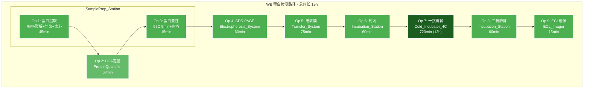

# SOP: 小鼠肠道组织焦亡检测 — Western Blot 篇

## 流程名称
小鼠肠道组织焦亡检测 — Western Blot 蛋白表达与剪切检测

## 适用场景
放射性肠炎（RE）及 Nic 治疗模型中，通过 Western Blot 检测 GSDMD、Caspase-1、NLRP3 与 ASC 四种焦亡相关蛋白的表达水平与剪切状态。

## 负责人
[待填写]

## 更新日期
2026-08-13

---

## 流程步骤

### 1. 样本接收与预处理

- **触发条件**：WB 路径组织送达（30-50mg 液氮速冻）
- **动作**：
  1. 从液氮中取出组织，置于预冷 RIPA 裂解液（含 PMSF 与蛋白酶/磷酸酶抑制剂）
  2. 冰上充分匀浆（组织充分裂解，无肉眼可见组织块）
  3. 4°C, 12,000 rpm 离心 15 min
  4. 收集上清，记录样本编号
- **完成标准**：获得清亮裂解液，样本编号与组织来源对应

### 2. BCA 蛋白定量与浓度调平

- **触发条件**：蛋白裂解液制备完成
- **动作**：
  1. 配制 BSA 标准品系列（0, 2, 4, 6, 8, 10 μg/mL）
  2. 取 25μL 样本/标准品 + 200μL BCA 工作液，37°C 孵育 30 min
  3. 读取 A562 吸光度，绘制标准曲线
  4. 根据标准曲线计算各样本蛋白浓度
  5. 用裂解液将所有样本调整至相同浓度（建议 2-3 μg/μL）
- **完成标准**：
  - 标准曲线 R² > 0.99
  - 各样本浓度变异系数 < 10%

### 3. 蛋白变性

- **触发条件**：蛋白样本定量完成
- **动作**：
  1. 取 30μL 蛋白样本 + 10μL 4× 上样缓冲液（含 DTT），3:1 混匀
  2. 95°C 加热 5 min
  3. 立即置于冰浴冷却 2 min
  4. 短暂离心（12,000 rpm，30s），使样本聚于管底
- **完成标准**：样本完全变性，无凝结物

### 4. SDS-PAGE 电泳

- **触发条件**：蛋白样本变性完成
- **动作**：
  1. 组装 8-12% 梯度 SDS-PAGE 胶（Mini-PROTEAN Tetra 系统）
  2. 加入 1× MOPS 电泳缓冲液
  3. 每孔上样 20-30 μg 蛋白，分子量 Marker 3-5 μL
  4. 120-150V 恒压电泳 50-60 min，至染料前沿到达分离胶底部
- **完成标准**：
  - 电泳条带分离良好，无拖尾
  - NLRP3 (~118kDa) 在上部清晰分离
  - GSDMD-N (~30kDa)、ASC (~22kDa)、Caspase-1 p20 (~20kDa) 在下部可分辨

### 5. 电转膜

- **触发条件**：电泳结束
- **动作**：
  1. 0.22μm PVDF 膜用甲醇活化 30s → 水浸泡 1min
  2. 按"海绵→滤纸→胶→PVDF→滤纸→海绵"顺序组装转膜夹层（注意胶-膜方向）
  3. 加入预冷转膜缓冲液（含 20% 甲醇）
  4. 4°C 下 300mA 恒流转膜 60-90 min
  5. Ponceau S 染色验证转膜效果
- **完成标准**：
  - Ponceau S 染色显示全泳道蛋白均匀分布
  - 预染 Marker 各分子量条带均已转移至膜上

### 6. 封闭与抗体孵育

- **触发条件**：转膜完成
- **动作**：
  1. 5% 脱脂奶粉（TBS-T 配制）RT 封闭 1 h
  2. 加入一抗（按如下稀释），4°C 孵育过夜：
     - Anti-GSDMD (CST #96458)：1:1000
     - Anti-Cleaved Caspase-1 p20 (AdipoGen)：1:500
     - Anti-NLRP3 (AdipoGen)：1:1000
     - Anti-ASC (CST #67824)：1:1000
  3. TBS-T 洗涤 3×10 min
  4. 加入 HRP 标记二抗（1:3000），RT 孵育 1 h
  5. TBS-T 洗涤 3×10 min
- **完成标准**：
  - 一抗充分结合（4°C 孵育 ≥ 8h）
  - 二抗孵育充分

### 7. ECL 化学发光成像

- **触发条件**：二抗孵育与洗涤完成
- **动作**：
  1. 配制 ECL 化学发光底物（A:B = 1:1）
  2. 将底物均匀覆盖膜表面，RT 孵育 1-2 min
  3. 使用 ChemiDoc 成像系统获取信号
  4. 保存原始图像，分析灰度值
- **完成标准**：
  - 信噪比 > 3:1
  - 获得以下条带：
    - GSDMD-N (~30kDa) / 全长 (~53kDa)
    - Cleaved Caspase-1 p20 (~20kDa) / 前体 (~45kDa)
    - NLRP3 (~118kDa)
    - ASC (~22kDa)

### 8. 结果判读

- **触发条件**：ECL 成像完成
- **动作**：
  1. 使用 ImageJ 分析各条带灰度值
  2. 以 β-actin 或 GAPDH 为内参校正
  3. 计算 GSDMD-N / 全长比值、Caspase-1 p20 / 前体比值
  4. 统计分析（RE 组 vs Nic 组 vs 对照组）
- **判定标准**：
  - **焦亡激活**：GSDMD-N 剪切体出现，GSDMD-N/全长 ≥ 0.3
  - **Caspase-1 激活**：p20 条带清晰可见
  - **NLRP3 上调**：与对照组相比表达显著增加
  - **ASC 变化**：单体减少（必要时观察多聚体）

---

## Lab Automation 分析

### Instrument-Lane Operation Diagram (Mermaid)



### 资源映射表

| 仪器 | 类型 | 用途 | 状态 |
|:---|:---|:---|:---|
| SamplePrep_Station | 共享 | 蛋白提取、变性 | 多样本可排队 |
| ProteinQuantifier | 独占 | BCA 定量 | 需预约 |
| Electrophoresis_System | 独占 | SDS-PAGE 电泳 | 需预约 |
| Transfer_System | 独占 | 电转膜 | 需预约 |
| Incubation_Station | 共享 | 封闭、二抗孵育 | 可多通道 |
| Cold_Incubator_4C | 共享 | 4°C 一抗孵育 | 关键资源 |
| ECL_Imager | 独占 | 化学发光成像 | 需预约 |

### TCMB 时间约束

| 前驱操作 | 边界 | 后继操作 | 边界 | 最大间隔 | 原因 |
|:---|:---|:---|:---|:---|:---|
| Op 2 (蛋白提取) | end | Op 3 (BCA定量) | start | 10 min | 蛋白降解风险 |
| Op 3 (BCA定量) | end | Op 4 (变性) | start | 30 min | 浓度稳定性 |
| Op 4 (变性) | end | Op 5 (SDS-PAGE) | start | 30 min | 蛋白复性风险 |
| Op 5 (SDS-PAGE) | end | Op 6 (电转膜) | start | 30 min | 蛋白扩散 |
| Op 6 (电转膜) | end | Op 7 (封闭) | start | 30 min | 膜干燥 |
| Op 7 (一抗孵育) | end | Op 8 (二抗孵育) | start | 60 min | 抗体结合稳定性 |

### 关键路径分析

```
蛋白提取(45') → BCA定量(60') → 变性(15') → SDS-PAGE(60') → 电转膜(75') → 封闭(60') → 一抗孵育(720') → 二抗孵育(60') → ECL成像(15')
                                                                                                            ↑
                                                                                                   关键瓶颈: 12h 过夜
```

**总时长**：19h（受限于 4°C 一抗孵育）

### 瓶颈分析

| 瓶颈 | 原因 | 缓解措施 |
|:---|:---|:---|
| Cold_Incubator_4C | 12h 孵育为必经步骤 | 利用夜间时段；多样本批量处理 |
| ECL_Imager | 独占资源 | 集中成像，减少等待 |
| Transfer_System | 电转需 4°C 环境 | 提前预冷缓冲液 |

---

## 材料 Metadata

### WB 专用试剂清单

| 编号 | 试剂名称 | 货号/规格 | 供应商 | 存储条件 | 用量/样本 |
|:---|:---|:---|:---|:---|:---|
| W-R1 | RIPA 裂解液（含 PMSF） | 100mL | 碧云天 | 4°C | 500μL |
| W-R2 | 蛋白酶抑制剂 Cocktail | 100× | CST | -20°C | 5μL/mg |
| W-R3 | 磷酸酶抑制剂 Cocktail | 100× | CST | -20°C | 5μL/mg |
| W-R4 | BCA 蛋白定量试剂盒 | 500 次 | Thermo | RT | 25μL |
| W-R5 | 8-12% 梯度 SDS-PAGE 胶 | 10 孔 | Bio-Rad | 4°C | 1 块 |
| W-R6 | 4× 上样缓冲液（含 DTT） | 10mL | Bio-Rad | RT | 10μL |
| W-R7 | 1× MOPS 电泳缓冲液 | 1L | Bio-Rad | RT | 1L |
| W-R8 | 0.22μm PVDF 膜 | 7×8.5cm | Bio-Rad | RT | 1 张 |
| W-R9 | 转膜缓冲液（含甲醇） | 1L | Bio-Rad | RT | 1L |
| W-R10 | 5% 脱脂奶粉 | 500mL | - | 4°C | 20mL |
| W-R11 | TBS-T 洗脱液 | 1L | - | RT | 500mL |
| W-R12 | ECL 化学发光底物 | 100mL | Millipore | 4°C | 1mL |
| W-R13 | Anti-GSDMD (N端特异) | CST #96458 | CST | -20°C | 1:1000 |
| W-R14 | Anti-Cleaved Caspase-1 (p20) | AdipoGen | AdipoGen | -20°C | 1:500 |
| W-R15 | Anti-NLRP3 | AdipoGen | AdipoGen | -20°C | 1:1000 |
| W-R16 | Anti-ASC (WB 用) | CST #67824 | CST | -20°C | 1:1000 |
| W-R17 | HRP 标记二抗 | CST #7074/7076 | CST | -20°C | 1:3000 |

### WB 专用仪器清单

| 编号 | 仪器名称 | 型号 | 位置 | 状态 |
|:---|:---|:---|:---|:---|
| W-I1 | 组织匀浆仪 | - | 细胞室 | 需确认 |
| W-I2 | 冷冻离心机 | Eppendorf 5810R | 细胞室 | 需确认 |
| W-I3 | 蛋白定量仪 | Nanodrop/BCA读板仪 | 生化室 | 需确认 |
| W-I4 | 电泳仪 | Bio-Rad PowerPac | 电泳室 | 需确认 |
| W-I5 | 转膜仪 | Bio-Rad Trans-Blot | 电泳室 | 需确认 |
| W-I6 | 4°C 冷孵箱 | - | 细胞室 | 需确认 |
| W-I7 | ECL 成像系统 | Bio-Rad ChemiDoc | 成像室 | 需确认 |

---

## 常见问题

- **WB 条带弱或无信号**：检查转膜效率（PVDF 活化、电流/时间）、抗体浓度、ECL 底物新鲜度；使用 Ponceau S 染色验证转膜效果
- **NLRP3 高分子量泳道弯曲**：使用 8% 分离胶、延长电泳时间、降低电压；确保缓冲液新鲜
- **GSDMD-N 剪切体与全长难以分离**：使用 12% 胶、延长转膜时间、0.22μm 膜防止小分子穿透
- **Caspase-1 p20 (~20kDa) 与 ASC (~22kDa) 条带重叠**：使用 15% 胶或优化转膜时间
- **一抗 4°C 孵育过夜后效价降低**：使用密封膜防止蒸发、加入 0.02% NaN₃ 防腐
- **ECL 信号过饱和**：缩短曝光时间、更换新鲜底物、降低二抗浓度

---

## 卡点预警

| 步骤 | 完成标准 | 未达标准 |
|:---|:---|:---|
| 蛋白定量 | R² > 0.99 | 重新配制 BSA 标准品 |
| SDS-PAGE | 指示剂达分离胶底部 | 延长电泳或更换缓冲液 |
| 转膜 | Ponceau S 染色均匀 | 检查转膜夹层/海绵 |
| 一抗孵育 | 4°C 孵育 ≥ 8h | 使用旋转孵育器增强结合 |
| ECL 成像 | 信噪比 > 3:1 | 增加曝光时间或更换底物 |

---

## 注意事项

- Caspase-1 p20 (~20kDa) 和 ASC (~22kDa) 分子量接近，需注意胶浓度与转膜条件
- GSDMD-N 剪切体检测需使用识别 N 端的特异性抗体（如 CST #96458）
- 所有操作在冰上或 4°C 进行，防止蛋白降解
- PVDF 膜必须用甲醇充分活化（至少 30s）
- ECL 底物对光敏感，需避光保存

---

## 相关文件

- [综合 SOP 索引](file:///workspace/SOP_小鼠肠道组织焦亡检测.md)
- [IHC/IF SOP](file:///workspace/SOP_小鼠肠道组织焦亡检测_IHC_IF.md)
- [交互式甘特图](file:///workspace/gantt_pyroptosis.html)
- [labauto_prompt.md](file:///workspace/labauto_prompt.md)
- [SLab.jl 调度引擎](file:///workspace/src/SLab.jl)
- [simulation case](file:///workspace/examples/case_pyroptosis)