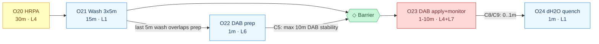
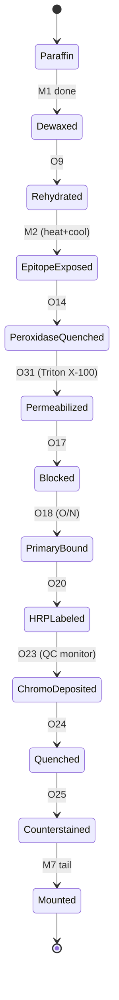
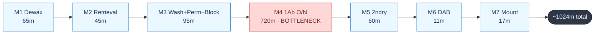
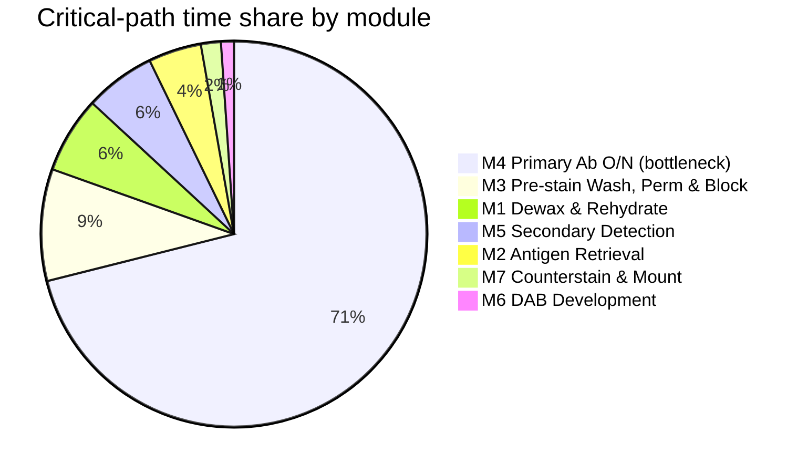
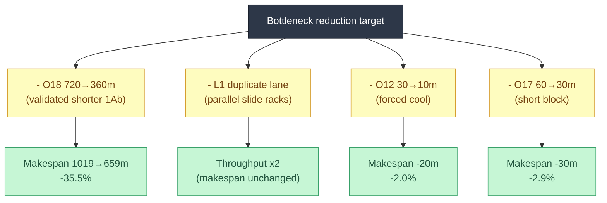

# IHC (Immunohistochemistry) Staining — System Operation File

> Generated per `labauto_prompt.md` — a systems-engineering / MES-style lab-automation operation model.
> All durations in **minutes** unless stated otherwise. "s" = seconds.

## 1. Experiment Modular Decomposition

The wet protocol is decomposed into 7 cyber-physical modules. Each module is a set of atomic, schedulable operations bound to persistent instrument resources, with explicit input/output sample states and QC triggers.

| Module | Responsibility | Ops (range) | Sample state transition (in → out) |
|--------|---------------|-------------|--------------------------------------|
| M1 Dewax & Rehydrate | Remove paraffin, rehydrate tissue | O1–O9 | Paraffin block → Aqueous-rehydrated section |
| M2 Antigen Retrieval | Unmask epitopes by heat (pH 6.0 citrate buffer) | O10–O12 | Rehydrated → Epitope-exposed |
| M3 Pre-stain Wash & Block | Quench peroxidase, permeabilize membranes, block non-specific sites | O13–O17, O31 | Epitope-exposed → Blocked (NS-sites occupied) |
| M4 Primary Antibody | Bind primary antibody to target | O18 | Blocked → Primary-bound |
| M5 Secondary Detection | HRP-polymer secondary incubation | O19–O21 | Primary-bound → HRP-labeled |
| M6 DAB Development | Chromogen deposition + quench | O22–O24 | HRP-labeled → Chromogen-deposited |
| M7 Counterstain, Dehydrate & Mount | Nuclear stain, clear, seal | O25–O30 | Chromogen-deposited → Permanent mounted slide |

### Operation catalogue

| Op_ID | Task | Module | Input state | Output state | Duration | Resource (machine type) | Blocking | Sync condition | QC trigger |
|-------|------|--------|--------------|--------------|----------|--------------------------|----------|----------------|------------|
| O1 | Xylene dewax 1/3 | M1 | Paraffin slide | Partially dewaxed | 5 | L1 Staining Jar | Blocking | O0 complete | Xylene clarity |
| O2 | Xylene dewax 2/3 | M1 | Partially dewaxed | Mostly dewaxed | 5 | L1 Staining Jar | Blocking | O1 end | — |
| O3 | Xylene dewax 3/3 | M1 | Mostly dewaxed | Fully dewaxed | 5 | L1 Staining Jar | Blocking | O2 end | — |
| O4 | 100% EtOH 1/2 | M1 | Dewaxed | 100% EtOH-1 | 10 | L1 Staining Jar | Blocking | O3 end | — |
| O5 | 100% EtOH 2/2 | M1 | 100% EtOH-1 | 100% EtOH-2 | 10 | L1 Staining Jar | Blocking | O4 end | — |
| O6 | 95% EtOH 1/2 | M1 | 100% EtOH-2 | 95% EtOH-1 | 10 | L1 Staining Jar | Blocking | O5 end | — |
| O7 | 95% EtOH 2/2 | M1 | 95% EtOH-1 | 95% EtOH-2 | 10 | L1 Staining Jar | Blocking | O6 end | — |
| O8 | dH2O rinse 1/2 | M1 | 95% EtOH-2 | Rinse-1 | 5 | L1 Staining Jar | Blocking | O7 end | — |
| O9 | dH2O rinse 2/2 | M1 | Rinse-1 | Rehydrated | 5 | L1 Staining Jar | Blocking | O8 end | — |
| O10 | pH 6.0 citrate immersion + heat-to-boil | M2 | Rehydrated | Pre-boil | 5 | L2 Microwave + L9 Citrate Buffer Reservoir (pH 6.0) | Blocking | O9 end | Boil onset; pH 6.0 ±0.1 |
| O11 | Sub-boil incubate 95–98°C (pH 6.0 citrate) | M2 | Pre-boil | Retrieved | 10 | L2 Microwave | Blocking | O10 end (Δ≤0) | Temp 95–98°C; pH drift <0.2 |
| O12 | Bench cool | M2 | Retrieved | Cooled-retrieved | 30 | L3 Cooling Bench | Non-blocking (timer) | O11 end | ΔT to RT |
| O13 | dH2O wash 3×5min | M3 | Cooled-retrieved | Washed-1 | 15 | L1 Staining Jar | Blocking | O12 end | — |
| O14 | 3% H2O2 incubation | M3 | Washed-1 | Peroxidase-quenched | 10 | L4 Humid Chamber | Blocking | O13 end | Bubble absence |
| O15 | dH2O wash 2×5min | M3 | Peroxidase-quenched | Washed-2 | 10 | L1 Staining Jar | Blocking | O14 end | — |
| O31 | Triton X-100 permeabilization (0.1–0.3% in PBS) | M3 | Washed-2 | Permeabilized | 5 | L1 Staining Jar | Blocking | O15 end | Even coverage; no tissue detachment |
| O16 | Wash buffer | M3 | Permeabilized | Buffer-primed | 5 | L1 Staining Jar | Blocking | O31 end | — |
| O17 | Block (RT) | M3 | Buffer-primed | Blocked | 60 | L4 Humid Chamber | Non-blocking (timer) | O16 end | Full coverage |
| O18 | Primary antibody 4°C O/N | M4 | Blocked | Primary-bound | 720 | L5 Cold Incubator | Non-blocking (timer) | O17 end | Antibody spec sheet |
| O19 | Wash buffer 3×5min | M5 | Primary-bound | Washed-P1 | 15 | L1 Staining Jar | Blocking | O18 end | — |
| O20 | HRPA incubation RT | M5 | Washed-P1 | HRP-labeled | 30 | L4 Humid Chamber | Non-blocking (timer) | O19 end | Humid-chamber seal |
| O21 | Wash buffer 3×5min | M5 | HRP-labeled | Washed-P2 | 15 | L1 Staining Jar | Blocking | O20 end | — |
| O22 | DAB reagent prep | M6 | (DAB stock) | DAB-ready | 1 | L6 Reagent Dispenser | Blocking | (parallel w/ O21 tail) | Mix homogeneity |
| O23 | DAB apply + monitor | M6 | Washed-P2 + DAB-ready | Chromogen-deposited | 5 (1–10) | L4 Humid Chamber + L7 QC Microscope | Blocking | O21 end ∧ O22 end | Signal vs background |
| O24 | dH2O quench | M6 | Chromogen-deposited | Quenched | 1 | L1 Staining Jar | Blocking | O23 end (Δ≤1) | Reaction stopped |
| O25 | Hematoxylin counterstain | M7 | Quenched | Counterstained | 3 | L1 Staining Jar | Blocking | O24 end | Nuclear signal |
| O26 | dH2O wash 2×5min | M7 | Counterstained | Washed-C | 10 | L1 Staining Jar | Blocking | O25 end | — |
| O27 | Dehydrate 95% EtOH 2×10s | M7 | Washed-C | Dehyd-95 | 0.33 | L1 Staining Jar | Blocking | O26 end | — |
| O28 | Dehydrate 100% EtOH 2×10s | M7 | Dehyd-95 | Dehyd-100 | 0.33 | L1 Staining Jar | Blocking | O27 end | — |
| O29 | Clear xylene 2×10s | M7 | Dehyd-100 | Cleared | 0.33 | L1 Staining Jar | Blocking | O28 end | — |
| O30 | Coverslip mount | M7 | Cleared | Mounted slide | 2 | L8 Mounting Station | Blocking | O29 end | No bubbles |

## 2. Resource Mapping Table

Persistent instrument resources are modelled as reusable **lanes**. A lane is occupied for the whole duration of each operation and released at operation end.

| Lane | Machine type | Machine name | Capacity | Reused by ops | Role |
|------|--------------|--------------|----------|---------------|------|
| L1 | 1 | Staining Jar Station (Coplin jars: xylene / 100% EtOH / 95% EtOH / dH2O / wash buffer / Triton X-100 in PBS) | 1 slide rack/jar | O1–O9, O13, O15, O16, O19, O21, O24–O29, O31 | Solvent exchange, rinses & permeabilization |
| L2 | 2 | Microwave Oven | 1 slide tray | O10, O11 | Heat-induced epitope retrieval (pH 6.0 citrate) |
| L3 | 3 | Cooling Bench | multi-slide | O12 | Passive cool-down |
| L4 | 4 | Humid Incubation Chamber (RT) | multi-slide | O14, O17, O20, O23 | Antibody/DAB humid incubation |
| L5 | 5 | Cold Incubator (4°C) | multi-slide | O18 | Overnight primary antibody |
| L6 | 6 | Reagent Dispenser | 1 prep | O22 | DAB working-solution preparation |
| L7 | 7 | QC Microscope Station | 1 slide | O23 | Real-time DAB monitoring |
| L8 | 8 | Mounting Station | 1 slide | O30 | Coverslip sealing |
| L9 | 9 | Citrate Buffer Reservoir (10 mM sodium citrate, pH 6.0 ±0.1, RT) | 1 slide tray bath | O10 (load), O11 (held) | Antigen-retrieval reagent supply & pH QC |

> **Human vs automated**: In a mes-model of this protocol the bulk of solvent-exchange ops (L1), reagent-addition ops (L4/L6/L8), and the pH 6.0 citrate buffer preparation/loading of L9 are **operator-driven** (manual transfer of slide rack between jars / manual pipetting / manual pH meter check). L2 (microwave), L3 (cooling), L5 (cold incubator) and L7 (imaging) are **instrument-driven** with non-blocking timer semantics.

## 3. TCMB Constraint Matrix

TCMB (Time Constraints by Mutual Boundaries) entries encode coupled timing: `Op_i . point_i  →  Op_j . point_j  : T` meaning the boundary `point_j` of `Op_j` must occur exactly `T` minutes after `point_i` of `Op_i` (positive = min-wait / separation; the runtime treats negative/zero as max-delay tolerance windows).

| ID | Op_i | Point_i | Op_j | Point_j | T (min) | Semantics |
|----|------|---------|------|---------|---------|-----------|
| C1 | O10 | end | O11 | start | 0 | Heat coupling: sub-boil must start immediately at boil onset (no cool gap) |
| C2 | O11 | end | O12 | start | 0 | Slide leaves microwave straight to cooling bench |
| C3 | O11 | start | O12 | end | 40 | Retrieval thermal envelope (10 min sub-boil + 30 min cool = 40 min fixed window) |
| C4 | O22 | end | O23 | start | 0 | DAB working solution applied immediately after preparation |
| C5 | O22 | end | O23 | start | -10 | **Max delay tolerance**: DAB must be applied within 10 min of prep (DAB stability) |
| C6 | O23 | start | O23 | end | 1 | DAB min development (monitoring floor) |
| C7 | O23 | start | O23 | end | -10 | DAB max development window (1–10 min) |
| C8 | O23 | end | O24 | start | 0 | Immediate dH2O quench once acceptable signal reached |
| C9 | O23 | end | O24 | start | -1 | Max 1 min delay tolerance before quench (over-development risk) |
| C10 | O17 | end | O18 | start | 0 | Primary Ab added right after block removal |
| C11 | O18 | start | O18 | end | 720 | Primary Ab **min incubation** (overnight @ 4°C) |
| C12 | O18 | start | O18 | end | -960 | Primary Ab max incubation tolerance (~16 h ceiling) |
| C13 | O21 | end | O23 | start | 0 | DAB apply gated by completion of last wash |
| C14 | O12 | end | O13 | start | 0 | No rinse delay after cool-down |
| C15 | O10 | start | O10 | start | 0 | **pH pre-condition gate**: O10 cannot start until L9 citrate buffer QC confirms pH 6.0 ±0.1 (pre-state assertion, not a timer) |
| C16 | O10 | start | O11 | end | -15 | **pH drift tolerance**: citrate pH must remain within 6.0 ±0.2 across O10+O11 (15-min hot-window); pH meter log sampled at O10 start and O11 end |
| C17 | O31 | start | O31 | end | 5 | Triton X-100 permeabilization **target duration** (5 min) |
| C18 | O31 | start | O31 | end | -10 | **Max over-permeabilization tolerance**: O31 must not exceed 10 min (tissue morphology/antigen damage risk) |
| C19 | O31 | end | O16 | start | 0 | Immediate wash-buffer rinse after permeabilization (no Triton carry-over into block) |

> TSV-style rows (for the SLab scheduler) follow below in §6.

## 4. Operation DAG

```mermaid
flowchart TD
    START([START: Paraffin slide]):::startEnd
    END([END: Mounted permanent slide]):::startEnd

    subgraph M1["M1 — Dewax & Rehydrate"]
        O1["O1 Xylene 1/3<br/>5m · L1"]:::op
        O2["O2 Xylene 2/3<br/>5m · L1"]:::op
        O3["O3 Xylene 3/3<br/>5m · L1"]:::op
        O4["O4 100% EtOH 1/2<br/>10m · L1"]:::op
        O5["O5 100% EtOH 2/2<br/>10m · L1"]:::op
        O6["O6 95% EtOH 1/2<br/>10m · L1"]:::op
        O7["O7 95% EtOH 2/2<br/>10m · L1"]:::op
        O8["O8 dH2O rinse 1/2<br/>5m · L1"]:::op
        O9["O9 dH2O rinse 2/2<br/>5m · L1"]:::op
    end

    subgraph M2["M2 — Antigen Retrieval (pH 6.0 citrate)"]
        O10["O10 pH6 citrate + heat-to-boil<br/>5m · L2+L9"]:::opAuto
        O11["O11 Sub-boil 95-98C (pH6 citrate)<br/>10m · L2"]:::opAuto
        O12["O12 Bench cool<br/>30m · L3 Cooling"]:::opWait
    end

    subgraph M3["M3 — Pre-stain Wash, Permeabilize & Block"]
        O13["O13 dH2O 3x5m<br/>15m · L1"]:::op
        O14["O14 3% H2O2<br/>10m · L4"]:::op
        O15["O15 dH2O 2x5m<br/>10m · L1"]:::op
        O31["O31 Triton X-100 perm<br/>5m · L1"]:::op
        O16["O16 Wash buffer<br/>5m · L1"]:::op
        O17["O17 Block RT<br/>60m · L4"]:::opWait
    end

    subgraph M4["M4 — Primary Antibody"]
        O18["O18 1Ab 4C O/N<br/>720m · L5 Cold"]:::opWait
    end

    subgraph M5["M5 — Secondary Detection"]
        O19["O19 Wash 3x5m<br/>15m · L1"]:::op
        O20["O20 HRPA RT<br/>30m · L4"]:::opWait
        O21["O21 Wash 3x5m<br/>15m · L1"]:::op
    end

    subgraph M6["M6 — DAB Development"]
        O22["O22 DAB prep<br/>1m · L6 Dispenser"]:::op
        O23["O23 DAB apply+monitor<br/>1-10m · L4+L7 QC"]:::opQC
        O24["O24 dH2O quench<br/>1m · L1"]:::op
    end

    subgraph M7["M7 — Counterstain, Dehydrate & Mount"]
        O25["O25 Hematoxylin<br/>3m · L1"]:::op
        O26["O26 dH2O 2x5m<br/>10m · L1"]:::op
        O27["O27 Dehyd 95% EtOH<br/>20s · L1"]:::op
        O28["O28 Dehyd 100% EtOH<br/>20s · L1"]:::op
        O29["O29 Clear xylene<br/>20s · L1"]:::op
        O30["O30 Mount<br/>2m · L8"]:::op
    end

    START --> O1
    O1 --> O2 --> O3 --> O4 --> O5 --> O6 --> O7 --> O8 --> O9
    O9 --> PHGATE{{"⚑ pH gate: citrate pH 6.0 ±0.1 (L9 QC)"}}
    PHGATE -->|C15: pre-condition| O10
    O10 -->|C1: T=0 heat coupling| O11
    O11 -->|C2: T=0| O12
    O12 --> O13
    O13 --> O14 --> O15 -->|post-H2O2 wash| O31
    O31 -->|C19: immediate rinse| O16
    O16 --> O17
    O17 -->|C10: T=0| O18
    O18 -->|C11: min 720m| O19
    O19 --> O20 --> O21
    O21 -->|C13: gate| O23
    O22 -->|C4/C5: 0 .. 10m| O23
    O21 -.parallel tail.-> O22
    O23 -->|C8/C9: 0..1m| O24
    O24 --> O25 --> O26 --> O27 --> O28 --> O29 --> O30
    O30 --> END

    classDef startEnd fill:#2d3748,stroke:#1a202c,color:#fff
    classDef op fill:#ebf8ff,stroke:#3182ce,color:#1a365d
    classDef opAuto fill:#e9d8fd,stroke:#805ad5,color:#3c1361
    classDef opWait fill:#fefcbf,stroke:#d69e2e,color:#744210
    classDef opQC fill:#fed7d7,stroke:#c53030,color:#742a2a
```



## 5. Instrument-Lane Operation Diagram

Each instrument is a **horizontal persistent lane**. Repeated usage of the same instrument reuses the same lane. Synchronization barriers (◇) and QC checkpoints (⚑) are shown explicitly; the only parallel region is the DAB-prep overlap with the tail of wash O21.

```mermaid
flowchart LR
    START([START]):::startEnd

    subgraph L1["L1 · Staining Jar Station"]
      direction LR
      L1a["O1<br/>Xyl1<br/>5m"]:::op
      L1b["O2<br/>Xyl2<br/>5m"]:::op
      L1c["O3<br/>Xyl3<br/>5m"]:::op
      L1d["O4<br/>100E1<br/>10m"]:::op
      L1e["O5<br/>100E2<br/>10m"]:::op
      L1f["O6<br/>95E1<br/>10m"]:::op
      L1g["O7<br/>95E2<br/>10m"]:::op
      L1h["O8<br/>dH2O1<br/>5m"]:::op
      L1i["O9<br/>dH2O2<br/>5m"]:::op
      L1j["O13<br/>dH2O3<br/>15m"]:::op
      L1k["O15<br/>dH2O4<br/>10m"]:::op
      L1perm["O31<br/>Triton<br/>5m"]:::op
      L1l["O16<br/>Wbuf1<br/>5m"]:::op
      L1m["O19<br/>Wbuf2<br/>15m"]:::op
      L1n["O21<br/>Wbuf3<br/>15m"]:::op
      L1o["O24<br/>Quench<br/>1m"]:::op
      L1p["O25<br/>Hemato<br/>3m"]:::op
      L1q["O26<br/>dH2O5<br/>10m"]:::op
      L1r["O27<br/>95E<br/>20s"]:::op
      L1s["O28<br/>100E<br/>20s"]:::op
      L1t["O29<br/>Xyl<br/>20s"]:::op
    end

    subgraph L2["L2 · Microwave Oven (pH 6.0 citrate)"]
      direction LR
      L2a["O10<br/>pH6-cit + boil<br/>5m"]:::opAuto
      L2b["O11<br/>Sub-boil pH6<br/>10m"]:::opAuto
    end

    subgraph L3["L3 · Cooling Bench"]
      direction LR
      L3a["O12<br/>Cool<br/>30m"]:::opWait
    end

    subgraph L4["L4 · Humid Chamber (RT)"]
      direction LR
      L4a["O14<br/>H2O2<br/>10m"]:::op
      L4b["O17<br/>Block<br/>60m"]:::opWait
      L4c["O20<br/>HRPA<br/>30m"]:::opWait
      L4d["O23<br/>DAB dev<br/>1-10m"]:::opQC
    end

    subgraph L5["L5 · Cold Incubator (4C)"]
      direction LR
      L5a["O18<br/>1Ab O/N<br/>720m"]:::opWait
    end

    subgraph L6["L6 · Reagent Dispenser"]
      direction LR
      L6a["O22<br/>DAB prep<br/>1m"]:::op
    end

    subgraph L7["L7 · QC Microscope"]
      direction LR
      L7a["O23-mon<br/>monitor<br/>1-10m"]:::opQC
    end

    subgraph L8["L8 · Mounting Station"]
      direction LR
      L8a["O30<br/>Mount<br/>2m"]:::op
    end

    subgraph L9["L9 · Citrate Buffer Reservoir (pH 6.0)"]
      direction LR
      L9qc["⚑ pH QC: 6.0 ±0.1"]:::opQC
      L9a["O10 load<br/>citrate bath"]:::op
      L9b["O11 held<br/>pH-drift log"]:::opQC
    end

    START --> L1a
    L1a --> L1b --> L1c --> L1d --> L1e --> L1f --> L1g --> L1h --> L1i
    L1i --> L9qc
    L9qc -->|C15 pH gate| L9a
    L9a --> L2a
    L2a --> L2b
    L2b -.pH log.-> L9b
    L2b --> L3a
    L3a --> L1j
    L1j --> L4a
    L4a --> L1k -->|post-H2O2 wash| L1perm
    L1perm -->|C19 rinse| L1l
    L1l --> L4b
    L4b --> L5a
    L5a --> L1m
    L1m --> L4c
    L4c --> L1n
    L1n --> SYN1{{◇ Sync barrier: O21 end ∧ O22 ready}}
    L1n -.-> L6a
    L6a --> SYN1
    SYN1 --> L4d
    L4d -.image loop.-> L7a
    L7a --> QC1{{⚑ QC: signal/background}}
    QC1 --> L1o
    L1o --> L1p --> L1q --> L1r --> L1s --> L1t
    L1t --> L8a
    L8a --> END([END]):::startEnd

    classDef startEnd fill:#2d3748,stroke:#1a202c,color:#fff
    classDef op fill:#ebf8ff,stroke:#3182ce,color:#1a365d
    classDef opAuto fill:#e9d8fd,stroke:#805ad5,color:#3c1361
    classDef opWait fill:#fefcbf,stroke:#d69e2e,color:#744210
    classDef opQC fill:#fed7d7,stroke:#c53030,color:#742a2a
```



### Parallel region & barriers (zoom)



## 6. Automation Scheduling Logic

### 6.1 State-machine view



### 6.2 SLab-compatible TSV inputs

The model maps directly onto the SLab.jl scheduler input files. Drop the four TSVs below into a new case directory (e.g. `examples/case_ihc/`) and run `julia --project=. bin/run.jl examples/case_ihc`.

**machines.tsv**
```
Machine_type	Machine_name
1	Staining Jar Station
2	Microwave Oven
3	Cooling Bench
4	Humid Chamber RT
5	Cold Incubator 4C
6	Reagent Dispenser
7	QC Microscope
8	Mounting Station
9	Citrate Buffer Reservoir pH6.0
```

**operations.tsv** (30 ops; durations in minutes; O27–O29 rounded up to 1m for scheduler granularity)
```
Operation_ID	Compatible_machine	Processing_time	Note
1	1	5	Xylene 1/3
2	1	5	Xylene 2/3
3	1	5	Xylene 3/3
4	1	10	100% EtOH 1/2
5	1	10	100% EtOH 2/2
6	1	10	95% EtOH 1/2
7	1	10	95% EtOH 2/2
8	1	5	dH2O rinse 1/2
9	1	5	dH2O rinse 2/2
10	2	5	pH6.0 citrate heat-to-boil
11	2	10	Sub-boil 95-98C pH6.0 citrate
12	3	30	Bench cool
13	1	15	dH2O 3x5m
14	4	10	3% H2O2
15	1	10	dH2O 2x5m
16	1	5	Wash buffer
17	4	60	Block RT
18	5	720	Primary Ab 4C O/N
19	1	15	Wash 3x5m
20	4	30	HRPA RT
21	1	15	Wash 3x5m
22	6	1	DAB prep
23	4	5	DAB apply+monitor
24	1	1	dH2O quench
25	1	3	Hematoxylin
26	1	10	dH2O 2x5m
27	1	1	Dehyd 95% EtOH 2x10s
28	1	1	Dehyd 100% EtOH 2x10s
29	1	1	Clear xylene 2x10s
30	8	2	Mount
31	1	5	Triton X-100 perm
```

**dependency.tsv** (DAG edges; O22 attaches to O21 with a sync join at O23)
```
Operation_ID_1	Operation_ID_2
1	2
2	3
3	4
4	5
5	6
6	7
7	8
8	9
9	10
10	11
11	12
12	13
13	14
14	15
15	31
31	16
16	17
17	18
18	19
19	20
20	21
21	23
22	23
23	24
24	25
25	26
26	27
27	28
28	29
29	30
```

**tcmb.tsv** (TCMB rows from §3; `Time_constraint` is the boundary-to-boundary offset in minutes, where a small/negative value encodes a max-delay tolerance)
```
Operation_ID_1	Point_1	Operation_ID_2	Point_2	Time_constraint
10	end	11	start	0
11	end	12	start	0
11	start	12	end	40
17	end	18	start	0
18	start	18	end	720
18	start	18	end	-960
21	end	23	start	0
22	end	23	start	0
22	end	23	start	-10
23	start	23	end	1
23	start	23	end	-10
23	end	24	start	0
23	end	24	start	-1
12	end	13	start	0
10	start	10	start	0
10	start	11	end	-15
31	start	31	end	5
31	start	31	end	-10
31	end	16	start	0
```

**config.tsv**
```
N_job	Sequential	Plot_range
1	0	5
```

### 6.3 Orchestration rules

1. **Sequential backbone** — O1→…→O30 forms a strict linear DAG; the scheduler cannot reorder M1–M7.
2. **Single non-blocking overlap** — O22 (DAB prep, 1 min on L6) is the only op that may run in parallel; it must start during the last ≤1 min of O21 (wash) so that DAB is ready exactly at the O21→O23 sync barrier. The `tcmb.tsv` row `22.end → 23.start : -10` caps DAB stand-time at 10 min.
3. **Timer-semantics ops** — O12 (cool), O17 (block), O18 (O/N primary), O20 (HRPA), O23 (DAB dev) are non-blocking timer ops: lane is reserved but operator is free; only the timer's expiry unblocks the successor.
4. **Max-delay windows** — DAB apply (O23) has a 1–10 min monitoring window bounded by both a min (C6) and a max (C7) TCMB row; quench O24 must fire within 1 min of acceptable-signal (C9).
5. **QC gating** — O23 → O24 transition is gated by the QC microscope (L7) reaching an acceptable signal/background ratio; failure triggers re-development (re-run O23) within the same window.
6. **Resource contention** — L1 (Staining Jar Station) is the single most contended lane (22 of 30 ops). It is the bottleneck on both ends of the timeline and must be batched (multi-slide racks) for throughput.
7. **Reusable lanes** — L4 (Humid Chamber) is reused for O14, O17, O20, O23; the scheduler must guarantee slide identity / reagent change-over between consecutive L4 ops.
8. **pH pre-condition gate (M2)** — O10 cannot start until the L9 citrate buffer reservoir passes pH QC (pH 6.0 ±0.1, C15). Across the 15-min O10+O11 hot window, pH drift is bounded to ±0.2 (C16); failure of either check aborts M2 and re-preps L9 buffer before re-running O10.
9. **L9 vs L2 dual-resource coupling** — O10 and O11 are scheduled on L2 (microwave, machine type 2) but depend on L9 (citrate reservoir, type 9) for reagent supply and pH monitoring; L9 must be primed and QC'd before O10 enters L2.

## 7. Critical Path Analysis

Critical path = the longest **must-be-sequential** chain through the DAG. The only parallelisable op (O22) saves at most 1 min, so the critical path is effectively the full backbone.

| Step | Op | Duration (min) | Cumulative (min) |
|------|----|----------------|-------------------|
| 1 | O1 Xylene 1/3 | 5 | 5 |
| 2 | O2 Xylene 2/3 | 5 | 10 |
| 3 | O3 Xylene 3/3 | 5 | 15 |
| 4 | O4 100% EtOH 1/2 | 10 | 25 |
| 5 | O5 100% EtOH 2/2 | 10 | 35 |
| 6 | O6 95% EtOH 1/2 | 10 | 45 |
| 7 | O7 95% EtOH 2/2 | 10 | 55 |
| 8 | O8 dH2O 1/2 | 5 | 60 |
| 9 | O9 dH2O 2/2 | 5 | 65 |
| 10 | O10 pH6 citrate heat-to-boil | 5 | 70 |
| 11 | O11 Sub-boil (pH6 citrate) | 10 | 80 |
| 12 | O12 Bench cool | 30 | 110 |
| 13 | O13 dH2O 3×5m | 15 | 125 |
| 14 | O14 3% H2O2 | 10 | 135 |
| 15 | O15 dH2O 2×5m | 10 | 145 |
| 16 | O31 Triton X-100 perm | 5 | 150 |
| 17 | O16 Wash buffer | 5 | 155 |
| 18 | O17 Block | 60 | 215 |
| 19 | **O18 Primary Ab O/N** | **720** | **935** |
| 20 | O19 Wash 3×5m | 15 | 950 |
| 21 | O20 HRPA | 30 | 980 |
| 22 | O21 Wash 3×5m | 15 | 995 |
| 23 | O23 DAB dev (max) | 10 | 1005 |
| 24 | O24 Quench | 1 | 1006 |
| 25 | O25 Hematoxylin | 3 | 1009 |
| 26 | O26 dH2O 2×5m | 10 | 1019 |
| 27 | O27 Dehyd 95% | 1 | 1020 |
| 28 | O28 Dehyd 100% | 1 | 1021 |
| 29 | O29 Clear xylene | 1 | 1022 |
| 30 | O30 Mount | 2 | 1024 |

> **Total critical path ≈ 1024 min (~17.1 h)**, of which **720 min (70.3%)** is the single overnight primary-antibody step O18. Excluding O18, the active wet-bench time is ≈ 304 min (~5.1 h).

### Critical-path mermaid



## 8. Bottleneck Analysis

| Rank | Bottleneck | Cause | Impact | Mitigation |
|------|-----------|-------|--------|-----------|
| 1 | **O18 Primary Ab O/N (L5)** | 720-min min-incubation on critical path; 70.3% of total makespan | Hard floor on makespan; defines the day-1→day-2 boundary | Schedule O18 last thing day-1; batch many slides per cold-incubator load; consider validated shorter/RT protocols only if QC permits |
| 2 | **L1 Staining Jar Station (contention)** | 23/31 ops contend one reusable lane (now incl. O31 Triton X-100 perm); serial jar-to-jar transfers dominate active bench time | Throughput ceiling for multi-slide runs; operator-bound | Use multi-slide racks; pre-stage jars in solvent-grade order; stagger slides across duplicated L1 lanes if hardware allows |
| 3 | **O12 Bench cool (30 m)** | Fixed passive cool-down on critical path with no QC shortcut | Adds 30 min before any M3 op can start | Replace passive cool with forced-air / chilled-block cool-down if epitope stability permits |
| 4 | **O17 Block (60 m, L4)** | 60-min timer; reuses same lane as O14, O20, O23 → identity/ change-over overhead | Serialises L4 occupancy; blocks primary-Ab start | Use ready-made blocker; pre-warm chamber; if validated, shorten to 30 min |
| 5 | **DAB window O23 (1–10 m, L4+L7)** | Operator-dependent monitoring + immediate quench (C8/C9, ≤1 m tolerance) | Risk of over/under-development; QC failure → re-run O23 | Automate imaging + timed quench (L7→L1 robotic transfer); pre-stage quench jar |
| 6 | **DAB stability C5 (max 10 m)** | O22 prep must converge with O21 end within 10 m | Couples reagent dispensing to wash schedule; hard sync barrier | Trigger O22 only when O21 has ≤1 m remaining; do not prep DAB speculatively |
| 7 | **Microwave heat-coupling C1 (T=0)** | O10 boil-onset → O11 sub-boil must be seamless | Microwave lid/opening timing risk; thermal overshoot | Use programmable microwave with boil-detect + auto-hold at 95–98 °C |
| 8 | **pH 6.0 citrate pre-condition (C15) + drift (C16)** | O10 blocked until L9 buffer passes pH 6.0 ±0.1; pH must hold within ±0.2 across the 15-min O10+O11 hot window | Adds QC gate before M2 starts; pH drift failure aborts O10 and re-preps L9 | Use pre-titrated 10 mM sodium citrate pH 6.0 stock; pH-probe the reservoir immediately before O10; log pH at O11 end; replenish buffer between slide batches |
| 9 | **Triton X-100 over-perm tolerance (C18, max 10 m)** | O31 target 5 min; over-incubation damages tissue morphology/antigen | Risk of morphology loss → QC failure → re-stain from M1 | Use timer-enforced L1 jar; pre-stage wash buffer jar (O16) for immediate C19 rinse; do not leave slides unattended during O31 |

### Bottleneck contribution



### Bottleneck sensitivity



---

**Summary.** The IHC protocol is a near-strictly-sequential **31-operation** DAG bound by **9** persistent instrument lanes (L1 staining jar, L2 microwave, L3 cooling bench, L4 humid chamber, L5 cold incubator, L6 reagent dispenser, L7 QC microscope, L8 mounting station, L9 pH 6.0 citrate buffer reservoir). M3 includes a **Triton X-100 permeabilization step (O31, 5 min, 0.1–0.3% in PBS)** inserted between the post-H2O2 wash (O15) and the wash-buffer rinse (O16), bounded by a 5-min target (C17) and a 10-min over-permeabilization ceiling (C18) with an immediate post-perm rinse (C19). M2 antigen retrieval uses **10 mM sodium citrate buffer at pH 6.0 ±0.1**, with a pre-condition pH gate (C15) before O10 and a ±0.2 pH-drift tolerance across the 15-min O10+O11 hot window (C16). The dominant bottleneck is the overnight primary-antibody incubation (O18, 720 min, 70.3% of the ~1024-min critical path); the Staining Jar Station (L1) is the dominant *resource-contention* bottleneck, reused by 23 of 31 ops. The only meaningful parallelism is the 1-min DAB-prep overlap (O22) gated by a ≤10-min DAB-stability TCMB window and a ≤1-min quench tolerance at O24. All diagrams above are Mermaid flowcharts: §4 Operation DAG (with pH gate ⚑ before O10 + O31 in M3), §5 Instrument-Lane diagram (+ L9 pH-QC lane + O31 in L1 + parallel-region zoom), §6.1 state-machine (with Permeabilized state), §7 critical path, §8 bottleneck pie + sensitivity tree.
