# LAB AUTOMATION SYSTEM OPERATION DOCUMENT
## IHC Double Staining: TOMM20 + 8-OHdG (Paraffin Section, Microwave Heat Retrieval — Protocol A)

**Document Type:** Lab MES — System Operation Specification
**Protocol Version:** A (A1 Recommended, A2/A3 Fallback)
**Scheduling Class:** TCMB-Constrained Batch Orchestration
**Sample Type:** Mouse Small Intestine (Jejunum/Ileum) Paraffin Blocks
**Throughput Model:** Slide-batch (n slides per run)

---

## 1. EXPERIMENT MODULAR DECOMPOSITION

| Module ID | Module Name | Responsibility | Sample State In | Sample State Out | Operator Class | Batch Size Unit |
|---|---|---|---|---|---|---|
| **M1** | DISSECTION_FIXATION_EMBED | Tissue acquisition, fixation, paraffin embed, microtome sectioning | Fresh tissue (uncertain state S0) | Mounted paraffin sections on APES slides (S1) | HUMAN (semi-auto microtome) | Tissue block |
| **M2** | DEPARAFFINIZE_REHYDRATE | Xylene → ethanol series → PBS hydration | S1: Paraffin-embedded mounted sections | S2: Deparaffinized, rehydrated sections | AUTO (stainer robot) | Slide rack (20/40 slides) |
| **M3** | ANTIGEN_RETRIEVAL | Heat-induced epitope retrieval (3 variant paths) | S2: Rehydrated sections | S3: Antigen-unmasked sections | AUTO (microwave/autoclave/acid station) | Slide rack |
| **M3-A1** | AR_MICROWAVE_pH6 | 10mM Citrate pH6.0 + MW 95–100°C 15min, cool 30min | S2 | S3 | AUTO + HUMAN QC | Slide rack |
| **M3-A2** | AR_AUTOCLAVE_pH9 | Tris-EDTA pH9.0 + Autoclave 121°C 5min (fallback, 8-OHdG SNR↑) | S2 | S3 | AUTO + HUMAN QC | Slide rack |
| **M3-A3** | AR_ACID_FROZEN | 2N HCl 20min + 0.1M Boric pH8.5 10min (frozen-only, DNA denature) | S2-frozen | S3 | AUTO | Slide rack |
| **M4** | ENDOGENOUS_ENZYME_KILL | 3% H₂O₂/MeOH RT 10min peroxidase quench | S3 | S4: Peroxidase-inactivated sections | AUTO (stainer robot) | Slide rack |
| **M5** | BLOCKING | 5% Normal Donkey Serum / 1% BSA / 0.3% Triton X-100, RT 1h | S4 | S5: Blocked sections | AUTO (stainer robot) | Slide rack |
| **M6** | PRIMARY_AB_COINCUBATE | TOMM20 Ab + 8-OHdG Ab cocktail, 4°C 16–18h | S5 | S6: Primary-bound sections (double-label) | AUTO (incubator + dispenser) | Slide rack |
| **M7** | SECONDARY_STAIN_DEVELOP | Signal amplification & chromophore deposition (2 variant paths) | S6 | S7: Stained sections (pre-mount) | AUTO (TSA/HRP stainer) | Slide rack |
| **M7-TSA** | TSA_MULTIPLEX | Anti-Rabbit HRP → Opal 520/570 → MW strip → Opal 650 (iterative, no cross-talk) | S6 | S7 | AUTO (stainer + MW strip station) | Slide rack (×rounds) |
| **M7-HRP** | HRP_CHROMOGEN_DAB_AEC | Anti-Rabbit-HRP+DAB → MW strip → Anti-Mouse/Goat-HRP+AEC | S6 | S7 | AUTO (stainer + MW strip station) | Slide rack (×rounds) |
| **M8** | COUNTERSTAIN_MOUNT | DAPI (IF) or Hematoxylin (DAB) → antifade mount / neutral balsam | S7 | S8: Final finished slides (READY) | HUMAN + AUTO (coverslipper) | Individual slide |

---

## 2. RESOURCE MAPPING TABLE

| Resource ID | Resource Name | Type | Assigned Modules | Capacity | Reusability | Lane ID |
|---|---|---|---|---|---|---|
| **R01** | Cold Room / 4°C Fixation Cabinet | Infrastructure | M1 | Unlimited (time-shared) | Shared | INFRA-1 |
| **R02** | Paraffin Embedder + Microtome | Instrument | M1 | 4 blocks/h | Semi-reusable (blade change) | TISSUE-LANE |
| **R03** | Automated Slide Stainer (Xylene/Ethanol/PBS Station) | Instrument | M2, M4, M5, M6 (reagent dispense), M7-TSA/M7-HRP | 40 slides/rack, 6 racks | **Persistent reusable lane** | STAINER-LANE |
| **R04** | Microwave Antigen Retrieval Station (95–100°C control) | Instrument | M3-A1, M7-TSA (Ab-strip between rounds) | 2 slide racks / run | **Persistent reusable lane (contention)** | MW-AR-LANE |
| **R05** | Autoclave (121°C programmable) | Instrument | M3-A2 (fallback path) | 4 slide racks / run | Reusable | AUTOCLAVE-LANE |
| **R06** | Acid Bath Station (HCl + Boric acid, fume hood) | Instrument | M3-A3 (frozen path only) | 1 rack / run | Reusable | ACID-LANE |
| **R07** | 4°C Refrigerated Incubator (Ab incubation) | Instrument | M6 | 8 slide racks | Shared time-slice | INCUB-4C-LANE |
| **R08** | TSA Fluorescence Workstation (Opal kit reagents, filter-based dispenser) | Instrument | M7-TSA Opal deposition rounds | 2 racks | Reusable | TSA-LANE |
| **R09** | HRP Chromogen Workstation (DAB + AEC reagents) | Instrument | M7-HRP DAB/AEC deposition rounds | 2 racks | Reusable | HRP-LANE |
| **R10** | Automated Coverslipper | Instrument | M8 (mounting) | 20 slides/15 min | Reusable | MOUNT-LANE |
| **R11** | HUMAN — Histotech Operator | Human | M1 (dissection), M3 (QC: temp/pH verify), M8 (DAPI/Hematoxylin dispense + slide inspection) | 1 operator / batch | — | HUMAN-LANE |
| **R12** | pH Meter / Thermometer (QC probes) | Tool | M3 (pre-AR QC) | n probes | Shared | QC-TOOLS |
| **R13** | Reagent Inventory Manager (MES hook) | Software | All modules (consumables tracking) | Software-only | — | MES-LAYER |

**Resource Contention Hot-Spots (Bottleneck Candidates):**
- `MW-AR-LANE` (R04): Used in M3-A1 AND in every TSA/HRP stripping round of M7 → **PRIMARY BOTTLENECK**
- `STAINER-LANE` (R03): Shared across M2→M4→M5→M7-dispense → sequential by default, no parallel within same rack

---

## 3. TCMB CONSTRAINT MATRIX (Time Constraints by Mutual Boundaries)

| Constraint ID | Upstream Node | Downstream Node | Min Wait (t_min) | Max Delay (t_max) | Coupling Type | Notes |
|---|---|---|---|---|---|---|
| **TCMB-01** | M1: 4% PFA Fixation Start | M1: Fixation End (Embed Start) | 12 h | 24 h | **HARD COUPLING (8-OHdG critical)** | Fix >24 h → 8-OHdG signal loss (KB violation); <12 h → under-fixed |
| **TCMB-02** | M2: End (PBS transfer) | M3: AR Start | 0 min | 30 min | SOFT COUPLING | Drying risk → edge artifact; keep wet |
| **TCMB-03** | M3-A1: MW 95–100°C Reach | M3-A1: Cool-down Start | 15 min | 17 min | HARD | Exact hold window; over-boiling evaporates citrate |
| **TCMB-04** | M3-A1: Cool-down Start | M3-A1: AR End → M4 Start | 30 min | 40 min | SOFT | Insufficient cool → H₂O₂ evaporate, tissue damage |
| **TCMB-05** | M3-A2: 121°C Hold | M3-A2: Depressurize → cool | 5 min | 5 min | HARD | Exact; pressure vessel safety |
| **TCMB-06** | M4: H₂O₂ End → PBS wash | M5: Blocking Start | 5 min | 20 min | SOFT | Quick transition preferred |
| **TCMB-07** | M5: Block Start | M5: Block End → M6 Primary | 60 min | 90 min | HARD | <60 min → high NSB; >90 min waste, no benefit |
| **TCMB-08** | M6: 4°C Incubate Start | M6: Incubate End → Wash | 16 h | 18 h | **HARD COUPLING** | Core overnight window; <16h weak signal, >18h Ab dissociation risk |
| **TCMB-09** | M6 End (primary wash) | M7-TSA Round-1 Start | 15 min | 60 min | SOFT | Primary Ab stability post-wash |
| **TCMB-10** | M7-TSA: Opal Deposition End | M7-TSA: MW Antibody Strip Start | 5 min | 10 min | HARD (per round) | Minimize Opal carry-over diffusion |
| **TCMB-11** | M7-TSA: MW Strip End (cool) | M7-TSA: Next Round Primary Start | 15 min | 30 min | SOFT | Heat cool-down, re-block optional |
| **TCMB-12** | M7 Final Round End → Wash | M8: Counterstain + Mount | 0 min | 2 h | HARD (fluorophore) | Fluorophore photobleach window; DAPI immediately preferred |
| **TCMB-13** | M8: Mount (antifade dispense) | M8: Coverslip applied | 30 s | 5 min | HARD | Cure window before evaporation |
| **TCMB-14** | M3: AR Variant Decision Point | M3-A1 / M3-A2 / M3-A3 Select | 0 min | 5 min | DECISION GATE (SYNC BARRIER) | QC: 8-OHdG pilot / tissue type triggers branching |

---

## 4. OPERATION DAG (Directed Acyclic Graph) — MERMAID FLOWCHART

```mermaid
flowchart TD
    %% ===== DEFINITIONS =====
    classDef human fill:#FFE4B5,stroke:#D2691E,stroke-width:2px,color:black
    classDef auto fill:#B0E0E6,stroke:#4682B4,stroke-width:2px,color:black
    classDef qc fill:#FFB6C1,stroke:#C71585,stroke-width:2px,color:black
    classDef sync fill:#DDA0DD,stroke:#8B008B,stroke-width:2px,color:black
    classDef state fill:#98FB98,stroke:#228B22,stroke-width:2px,color:black
    classDef decision fill:#FFD700,stroke:#B8860B,stroke-width:2px,color:black

    %% ===== ENTRY =====
    START([START: IHC TOMM20 + 8-OHdG Run]) --> S0[S0: Fresh Mouse SI Tissue\nState: UNFIXED]

    %% ===== MODULE 1: DISSECTION & FIXATION =====
    S0 --> M1_OP1[M1.1: Dissect 1-2cm Jejunum/Ileum\nRinse with NS\nOperator: R11 HUMAN]:::human
    M1_OP1 --> QC1[QC-1: Tissue Integrity Check\nMucosa intact? Length OK?\nResource: R11]:::qc
    QC1 -->|FAIL| HOLD1[HOLD: Re-dissect or discard]
    QC1-->|PASS|M1_OP2[M1.2: 4% PFA 4°C Fix 12-24h\nResource: R01 Cold Room\nTCMB-01: HARD]:::auto
    M1_OP2 --> QC2[QC-2: Fixation Time Gate\nElapsed ∈ [12h,24h]?\nResource: R13 MES]:::qc
    QC2 -->|FAIL <12h| M1_OP2
    QC2 -->|FAIL >24h| WARN1[WARN: 8-OHdG signal ↓\nNotate in MES]:::sync
    QC2 -->|PASS| M1_OP3[M1.3: Paraffin Embed + Section 4-5μm\nMount on APES slides\nResource: R02 Microtome + R11]:::human
    WARN1 --> M1_OP3
    M1_OP3 --> S1[S1: Mounted Paraffin Sections\nState: READY FOR DEWAX]:::state

    %% ===== MODULE 2: DEPARAFFINIZE REHYDRATE =====
    S1 --> M2_OP1[M2.1: Load racks → Xylene 2×10min\nResource: R03 STAINER-LANE]:::auto
    M2_OP1 --> M2_OP2[M2.2: Ethanol Series 100%/95%/70% 各5min\nResource: R03]:::auto
    M2_OP2 --> M2_OP3[M2.3: Final PBS Equilibrate\nResource: R03]:::auto
    M2_OP3 --> S2[S2: Deparaffinized + Rehydrated\nState: READY FOR AR]:::state

    %% ===== MODULE 3: ANTIGEN RETRIEVAL BRANCH =====
    S2 --> DEC_AR{AR Variant\nDecision Gate\nTCMB-14 SYNC}:::decision
    DEC_AR -->|A1 DEFAULT\n(TOMM20+8OHdG通用)| M3A1_IN[M3-A1 INPUT\nCitrate pH6.0 + 0.05% Tween-20\nResource: R12 QC pH]:::qc
    DEC_AR -->|A2 IF 8-OHdG signal weak\n(Tris-EDTA pH9.0 SNR↑ KB)| M3A2_IN[M3-A2 INPUT\nTris 10mM + EDTA 1mM pH9.0\nResource: R12]:::qc
    DEC_AR -->|A3 IF FROZEN ONLY\n(skip heat)| M3A3_IN[M3-A3 INPUT\n2N HCl + 0.1M Boric pH8.5]:::qc

    %% --- PATH A1 (MW) ---
    M3A1_IN --> M3A1_OP1[M3-A1.1: MW Mid-High 95-100°C\nHOLD 15min (TCMB-03 HARD)\nResource: R04 MW-AR-LANE\n🔴 BOTTLENECK]:::auto
    M3A1_OP1 --> QC3A1[QC-3A1: Temperature Trace\n95-100°C ×15min?\nResource: R12 + R13]:::qc
    QC3A1 -->|FAIL| RETRY_A1[RETRY: re-heat or abort]
    QC3A1 -->|PASS| M3A1_OP2[M3-A1.2: Natural Cool → RT 30min\nTCMB-04 [30min,40min]\nResource: R04 (occupied)]:::auto
    M3A1_OP2 --> S3[S3: Antigen Unmasked (pH6 MW)]:::state

    %% --- PATH A2 (AUTOCLAVE) ---
    M3A2_IN --> M3A2_OP1[M3-A2.1: Autoclave 121°C 5min\nTCMB-05 HARD\nResource: R05 AUTOCLAVE-LANE]:::auto
    M3A2_OP1 --> QC3A2[QC-3A2: Pressure/Temp Log\n121°C×5min?]:::qc
    QC3A2 -->|FAIL| RETRY_A2[RETRY or abort]
    QC3A2 -->|PASS| M3A2_OP2[M3-A2.2: Depressurize → Cool RT 30min\nResource: R05]:::auto
    M3A2_OP2 --> S3

    %% --- PATH A3 (ACID FROZEN) ---
    M3A3_IN --> M3A3_OP1[M3-A3.1: 2N HCl RT 20min\n(DNA denature expose 8-OHdG)\nResource: R06 ACID-LANE]:::auto
    M3A3_OP1 --> M3A3_OP2[M3-A3.2: 0.1M Boric pH8.5 RT 10min\nNeutralize\nResource: R06]:::auto
    M3A3_OP2 --> S3

    %% ===== SYNC BARRIER: ALL AR PATHS MERGE =====
    S3 --> SYNC1[🛑 SYNC BARRIER\nAll racks reach S3?\nWash + PBS Equilibrate]:::sync

    %% ===== MODULE 4: ENZYME INACTIVATION =====
    SYNC1 --> M4_OP1[M4.1: 3% H2O2 / Methanol RT 10min\nResource: R03 STAINER-LANE]:::auto
    M4_OP1 --> M4_OP2[M4.2: PBS Wash 3×5min\nResource: R03]:::auto
    M4_OP2 --> S4[S4: Peroxidase Inactivated]:::state

    %% ===== MODULE 5: BLOCKING =====
    S4 --> M5_OP1[M5.1: Blocking Buffer dispense\n5% NDS / 1% BSA / 0.3% Triton\nResource: R03]:::auto
    M5_OP1 --> M5_OP2[M5.2: Incubate RT 1h\nTCMB-07 [60min,90min]\nResource: R03]:::auto
    M5_OP2 --> S5[S5: Blocked Sections]:::state

    %% ===== MODULE 6: PRIMARY AB CO-INCUBATION =====
    S5 --> M6_OP1[M6.1: Primary Cocktail Dispense\nTOMM20 Ab + 8-OHdG Ab → Blocking Buffer\nResource: R03 + R13 inventory check]:::auto
    M6_OP1 --> QC4[QC-4: Antibody Lot Check\nConcentration + expiration?\nResource: R13 MES]:::qc
    QC4 -->|FAIL| REPREP[RE-PREP: fresh Ab mix]
    QC4 -->|PASS| M6_OP2[M6.2: 4°C OVERNIGHT 16-18h\nTCMB-08 HARD\nResource: R07 INCUB-4C-LANE]:::auto
    M6_OP2 --> QC5[QC-5: Incubation Time Gate\nElapsed ∈ [16h,18h]?\nResource: R13]:::qc
    QC5 -->|FAIL <16h| M6_OP2
    QC5 -->|FAIL >18h| WARN2[WARN: Ab dissociation risk\nLog in MES]:::sync
    QC5 -->|PASS| M6_OP3[M6.3: Primary Wash PBST 3×5min\nResource: R03]:::auto
    WARN2 --> M6_OP3
    M6_OP3 --> S6[S6: Primary Ab Bound (Dual-label)]:::state

    %% ===== MODULE 7: SECONDARY + STAIN (2 VARIANTS) =====
    S6 --> DEC_STAIN{Staining Method\nDecision}:::decision
    DEC_STAIN -->|7-TSA RECOMMENDED\n(No cross-talk, Signal Amplify)| TSA_ENTRY
    DEC_STAIN -->|7-HRP TRADITIONAL\n(DAB Brown → AEC Red)| HRP_ENTRY

    %% ========= PATH 7-TSA MULTIPLEX =========
    TSA_ENTRY((TSA Branch Entry)):::sync --> TSA_R1_OP1[TSA-R1.1: Anti-Rabbit-HRP RT 30min\nResource: R08 TSA-LANE]:::auto
    TSA_R1_OP1 --> TSA_R1_OP2[TSA-R1.2: Opal 520/570 Deposition\nResource: R08]:::auto
    TSA_R1_OP2 --> QC_TSA1[QC-TSA-R1: Fluorophore QC\nNo precipitate?\nResource: R11 visual]:::qc
    QC_TSA1 -->|FAIL| RETRY_TSA[RETRY or proceed]
    QC_TSA1 -->|PASS| TSA_R1_STRIP[TSA-R1.3: MW Antibody Strip\nMW 95°C 5min → Cool 15min\nResource: R04 MW-AR-LANE 🔴\nTCMB-10 HARD]:::auto
    TSA_R1_STRIP --> TSA_R2_IN[TSA-R2 INPUT\nSecond Target (8-OHdG or TOMM20)]:::state
    TSA_R2_IN --> TSA_R2_OP1[TSA-R2.1: Primary Ab RT 1h\nResource: R08]:::auto
    TSA_R2_OP1 --> TSA_R2_OP2[TSA-R2.2: Secondary HRP RT 30min\nResource: R08]:::auto
    TSA_R2_OP2 --> TSA_R2_OP3[TSA-R2.3: Opal 650 Deposition\nResource: R08]:::auto
    TSA_R2_OP3 --> TSA_R2_STRIP[TSA-R2.4: MW Strip (if R3 needed)\nElse proceed\nResource: R04 🔴]:::auto
    TSA_R2_STRIP --> QC_TSA_END[QC-TSA-END: Round Completeness\n2/2 targets deposited?\nResource: R11 + R13]:::qc
    QC_TSA_END -->|PASS| S7[S7: TSA-Stained Sections]:::state

    %% ========= PATH 7-HRP CHROMOGEN =========
    HRP_ENTRY((HRP Branch Entry)):::sync --> HRP_R1_OP1[HRP-R1.1: Anti-Rabbit-HRP RT 30min\nResource: R09 HRP-LANE]:::auto
    HRP_R1_OP1 --> HRP_R1_OP2[HRP-R1.2: DAB Develop (Brown)\n3-10min → Water Stop\nResource: R09]:::auto
    HRP_R1_OP2 --> QC_HRP1[QC-HRP-R1: DAB Intensity\nAvoid over-stain\nResource: R11 visual]:::qc
    QC_HRP1 -->|FAIL| ADJ_TIME[ADJUST: shorter time next batch]
    QC_HRP1 -->|PASS| HRP_R1_STRIP[HRP-R1.3: MW Antibody Strip\nMW 95°C 5min → Cool\nResource: R04 MW-AR-LANE 🔴\nTCMB-10]:::auto
    HRP_R1_STRIP --> HRP_R2_OP1[HRP-R2.1: Anti-Mouse/Goat-HRP\nRT 30min\nResource: R09]:::auto
    HRP_R2_OP1 --> HRP_R2_OP2[HRP-R2.2: AEC Develop (Red)\n3-10min → Water Stop\nResource: R09]:::auto
    HRP_R2_OP2 --> QC_HRP2[QC-HRP-R2: AEC Intensity + No DAB carry-over\nResource: R11]:::qc
    QC_HRP2 -->|PASS| S7

    %% ===== SYNC BARRIER: STAINING PATHS MERGE =====
    S7 --> SYNC2[🛑 SYNC BARRIER\nAll racks reach S7?\nWash + prepare for M8]:::sync

    %% ===== MODULE 8: COUNTERSTAIN + MOUNT =====
    SYNC2 --> DEC_MOUNT{Mount Path\nDecision}:::decision
    DEC_MOUNT -->|IF TSA (Fluorescence)| M8_IF1[M8-IF.1: DAPI Nucleus Counterstain\nRT 5-10min\nResource: R03 + R11]:::human
    DEC_MOUNT -->|IF HRP-DAB/AEC (Brightfield)| M8_BF1[M8-BF.1: Hematoxylin Counterstain\n1-3min → Acid Alcohol Differentiate\n→ Blue in Scott Tap Water\nResource: R03 + R11]:::human
    M8_IF1 --> M8_IF2[M8-IF.2: Antifade Mounting Medium\nResource: R10 COVERSLIP-LANE]:::auto
    M8_BF1 --> M8_BF2[M8-BF.2: Dehydrate → Clear → Neutral Balsam\nResource: R03 + R10]:::auto
    M8_IF2 --> QC_FINAL[QC-FINAL: Coverslip QC\nNo bubbles, no edge artifact\nResource: R11]:::qc
    M8_BF2 --> QC_FINAL
    QC_FINAL -->|FAIL| REMOUNT[REMOUNT or salvage]
    QC_FINAL -->|PASS| S8[S8: FINISHED SLIDES\nState: READY FOR IMAGING]:::state
    S8 --> END([END: Batch Complete → Imager Queue])

```

---

## 5. INSTRUMENT-LANE OPERATION DIAGRAM (PERSISTENT RESOURCE LANES)

```mermaid
flowchart LR
    %% ============== STYLE DEFINITIONS ==============
    classDef laneHeader fill:#2F4F4F,color:white,stroke:black,stroke-width:2px
    classDef humanOp fill:#FFE4B5,stroke:#D2691E,stroke-width:1px,color:black
    classDef autoOp fill:#B0E0E6,stroke:#4682B4,stroke-width:1px,color:black
    classDef contention fill:#FF6347,stroke:#8B0000,stroke-width:2px,color:black,font-weight:bold
    classDef stateTrans fill:#98FB98,stroke:#228B22,stroke-width:1px,color:black
    classDef sync fill:#DDA0DD,stroke:#8B008B,stroke-width:2px,color:black

    %% ============== LANE HEADERS (Horizontal) ==============
    subgraph LEGEND
        direction LR
        L1(HUMAN op):::humanOp --- L2(AUTO op):::autoOp --- L3(🔴CONTENTION):::contention
    end

    %% PERSISTENT LANE HEADERS
    H1[👤 HUMAN-LANE\nR11]:::laneHeader
    H2[🧫 TISSUE-LANE\nR01,R02]:::laneHeader
    H3[🧪 STAINER-LANE\nR03]:::laneHeader
    H4[🔥 MW-AR-LANE\nR04 🔴HOT]:::laneHeader
    H5[♨️ AUTOCLAVE-LANE\nR05]:::laneHeader
    H6[🧪 ACID-LANE\nR06]:::laneHeader
    H7[❄️ INCUB-4C-LANE\nR07]:::laneHeader
    H8[🌈 TSA-LANE\nR08]:::laneHeader
    H9[🎨 HRP-LANE\nR09]:::laneHeader
    H10[📎 MOUNT-LANE\nR10]:::laneHeader
    H11[🖥️ MES-LAYER\nR13]:::laneHeader

    %% ============== TIMELINE FLOWS (Vertical arrows hidden, use row-aligned ops) ==============
    %% --- ROW 0: S0 Entry ---
    OP_T0_OP[Dissect SI\nRinse NS]:::humanOp --> H1
    S0_STATE((S0:Fresh)):::stateTrans --> H2

    %% --- ROW 1: M1 Fixation ---
    OP_H1_FIX[tissue QC\nverify]:::humanOp --> H1
    OP_T1_FIX[4%PFA 4°C\n12-24h\nTCMB-01]:::autoOp --> H2
    MES_1[Fix Timer\nTrack elapsed]:::autoOp --> H11

    %% --- ROW 2: M1 Embed ---
    OP_H2_EMB[Embed + Section\n4-5μm → APES]:::humanOp --> H1
    OP_T2_EMB[Microtome\nsection + mount]:::autoOp --> H2
    S1_STATE((S1:Paraffin\nMounted)):::stateTrans --> H2

    %% --- ROW 3: M2 Dewax Rehydrate ---
    OP_H3_LOAD[Load racks\nonto stainer]:::humanOp --> H1
    OP_S3_XYL[Xylene 2×10min]:::autoOp --> H3
    OP_S3_ETH[EtOH 100/95/70%\n各5min → PBS]:::autoOp --> H3
    S2_STATE((S2:Rehydrated)):::stateTrans --> H3

    %% --- ROW 4: M3 AR BRANCH ---
    OP_H4_QC[pH Verify\nAR Buffer QC]:::humanOp --> H1
    MES_4[AR variant\ndispatch]:::autoOp --> H11

    OP_MW_A1[MW 95-100°C\n15min HOLD]:::contention --> H4
    OP_MW_COOL[Natural Cool\n30min]:::autoOp --> H4

    OP_AU_A2[121°C\n5min HOLD]:::autoOp --> H5
    OP_AU_COOL[Depressurize\n+ Cool]:::autoOp --> H5

    OP_AC_A3a[2N HCl\n20min]:::autoOp --> H6
    OP_AC_A3b[Boric pH8.5\n10min]:::autoOp --> H6

    SYNC_AR((🛑SYNC)):::sync --> H11
    S3_STATE((S3:Unmasked)):::stateTrans --> H3

    %% --- ROW 5: M4 + M5 ---
    OP_S5_H2O2[3%H2O2/MeOH\nRT 10min]:::autoOp --> H3
    OP_S5_WASH1[PBS\n3×5min]:::autoOp --> H3
    OP_S5_BLOCK[Block Buffer\nRT 1h TCMB-07]:::autoOp --> H3
    S45_STATE((S4→S5)):::stateTrans --> H3

    %% --- ROW 6: M6 Primary Overnight ---
    OP_H6_ABMIX[Ab cocktail prep\n+ QC]:::humanOp --> H1
    OP_S6_DISP[Ab cocktail\ndispense]:::autoOp --> H3
    OP_I6_INC[4°C OVERNIGHT\n16-18h TCMB-08]:::autoOp --> H7
    MES_6[Incub Timer\ntrack]:::autoOp --> H11
    OP_S6_WASH[PBST 3×5min]:::autoOp --> H3
    S6_STATE((S6:Primary\nBound)):::stateTrans --> H3

    %% --- ROW 7: M7 TSA BRANCH ---
    OP_TSA1_R1[R1: Anti-Rb-HRP\n→ Opal520/570]:::autoOp --> H8
    OP_MW_STRIP1[MW STRIP R1\n95°C 5min]:::contention --> H4
    OP_TSA1_R2[R2: 2° Ab\n→ Opal650]:::autoOp --> H8
    OP_MW_STRIP2[MW STRIP R2\n95°C 5min]:::contention --> H4

    %% --- ROW 7b: M7 HRP BRANCH ---
    OP_HRP1_R1[R1: Anti-Rb-HRP\n→ DAB Brown]:::autoOp --> H9
    OP_MW_STRIPH[MW STRIP HRP\n95°C 5min]:::contention --> H4
    OP_HRP1_R2[R2: 2° Ab\n→ AEC Red]:::autoOp --> H9

    SYNC_STAIN((🛑SYNC)):::sync --> H11
    S7_STATE((S7:Stained)):::stateTrans --> H3

    %% --- ROW 8: M8 Counterstain + Mount ---
    OP_H8_CS[Counterstain:\nDAPI or Hematox]:::humanOp --> H1
    OP_MOUNT_MED[Mount Medium\ndispense]:::autoOp --> H3
    OP_MOUNT_CS[Coverslip\nApply]:::autoOp --> H10
    OP_H8_FQC[Final Slide QC\nVisual Inspect]:::humanOp --> H1
    MES_8[Batch close\n→ Imager Q]:::autoOp --> H11
    S8_STATE((S8:FINISHED)):::stateTrans --> H10
```



---

## 6. AUTOMATION SCHEDULING LOGIC

### 6.1 Batch Definition & Arrival Model
- **Batch quantum:** Slide Rack = 20 slides (default) / 40 slides (high-capacity stainer)
- **Arrival rate:** λ = 1 rack / 8 h (tissue processing cadence from M1)
- **Service order:** FIFO with priority preemption for `8-OHdG time-critical` samples (TCMB-01 breach risk)

### 6.2 Scheduler States
```
IDLE → PRE_M1 (tissue intake) → RUN_M1_FIX (long hold) → M1_DONE
    → PRE_M2_LOAD → RUN_M2_DEWAX → M2_DONE
    → AR_DISPATCH_GATE (DECIDE A1/A2/A3) → RUN_M3_A* → AR_DONE
    → RUN_M4_H2O2 → M4_DONE
    → RUN_M5_BLOCK → M5_DONE
    → RUN_M6_AB_DISP → RUN_M6_4C_HOLD (16-18h) → M6_WASH → M6_DONE
    → STAIN_DISPATCH_GATE (TSA vs HRP) → RUN_M7_R1 → RUN_MW_STRIP → RUN_M7_R2 → M7_DONE
    → RUN_M8_CS → RUN_M8_MOUNT → QC_FINAL → DONE
```

### 6.3 Resource Contention Resolution — MW-AR-LANE (R04)
The microwave station (R04) is required at:
1. M3-A1 initial AR (once per batch)
2. M7-TSA: ×N strip operations, N = number of Opal rounds (N=2 for dual-label default, expandable)
3. M7-HRP: ×N strip operations, N = number of chromogen rounds (N=2 default)

**Scheduling Policy for R04:**
- **Priority rule:** M3-A1 initial AR > M7-strip operations (no M7 can start before its batch clears M3)
- **Preemption:** No preemption mid-cycle (MW run integrity); queue pending requests
- **Parallelism:** R04 holds 2 racks physically; interleave racks → AR-batch1 followed by STRIP-batch1 while AR-batch2 waits
- **Deadline awareness:** TCMB-08 overnight window ends → M7-strip operations get priority (scheduler flag: `INCUB_EXPIRING_SOON`)

### 6.4 Parallel Regions
| Region | Parallel Operations | Enabling Condition |
|---|---|---|
| **P-REGION-1** | M1 Fixation (R01) × N blocks runs simultaneously | Different blocks, independent tissue states |
| **P-REGION-2** | M3-A2 autoclave runs (R05) concurrently with M3-A1 MW cool (R04 wait) — different batches, non-overlapping resources | A1-batch on cool-down frees operator |
| **P-REGION-3** | M6 4°C overnight hold (R07) × multiple racks | R07 capacity 8 racks; saturate overnight |
| **P-REGION-4** | TSA R1 Opal dispense (R08) while HRP-batch R2 AEC dispense (R09) — disjoint resources | Separate lanes, no contention |
| **P-REGION-5** | M8 coverslipper (R10) processes Rack-A while M7-strip (R04) processes Rack-B — disjoint | Different resources, no data coupling |

### 6.5 Blocking / Non-Blocking Classification
| Task | Behavior | Blocked On |
|---|---|---|
| M1 PFA Fix | Non-blocking (long timer) | Operator — no, R01 — no |
| M2 Dewax Series | Blocking (rack on stainer) | STAINER-LANE occupied |
| M3-A1 MW Hold | Blocking | MW-AR-LANE occupied + temperature locked |
| M3-A1 MW Cool | Non-blocking (timer) | Operator — no, R04 — semi-occupied (heat only) |
| M6 Overnight 4°C | Non-blocking (timer) | R07 slot occupied only |
| M7-TSA MW Strip | Blocking | MW-AR-LANE contention 🔴 |
| M8 Coverslip | Blocking (per slide) | MOUNT-LANE occupied |

---

## 7. CRITICAL PATH ANALYSIS

### 7.1 Critical Path (Default A1 + TSA dual-label — 2 Opal rounds)
```
M1 Dissect → M1 Fix (24h max worst) → M1 Embed/Section →
M2 Dewax Rehydrate (30min) →
M3-A1 MW 95°C 15min → COOL 30min →       [MW-LANE 🔴]
M4 H2O2 10min → PBS wash →
M5 Block 60min →
M6 Ab Dispense → M6 4°C 18h (worst) → M6 Wash →
TSA-R1: Anti-Rb-HRP 30min → Opal520/570 → MW-STRIP 1 [20min incl cool] →  [MW-LANE 🔴]
TSA-R2: Primary 1h → HRP 30min → Opal650 → MW-STRIP 2 [20min incl cool] → [MW-LANE 🔴]
M8 Counterstain → Mount → QC Final
```

**Critical Path Duration (Worst-Case Estimate):**
| Segment | Duration | Cumulative |
|---|---|---|
| M1 Dissect | 30 min | 0.5 h |
| M1 Fix (upper bound 24h) | 24 h | 24.5 h |
| M1 Embed + Section | 1 h | 25.5 h |
| M2 Dewax Rehydrate | 0.5 h | 26.0 h |
| M3-A1 MW AR + Cool | 0.75 h | 26.75 h |
| M4 + M5 (kill + block) | ~1.5 h | 28.25 h |
| M6 Overnight (upper 18h) | 18 h | 46.25 h |
| M7-TSA R1 + MW-STRIP | ~1.5 h | 47.75 h |
| M7-TSA R2 + MW-STRIP | ~2.5 h | 50.25 h |
| M8 Counterstain + Mount (20slides) | ~1.0 h | **51.25 h / rack** |

→ **Critical path wall time ≈ 51.3 h (~2.1 days) per rack for A1+TSA**

### 7.2 Alternative Paths Sensitivity
| Path Variant | Δ vs Critical | Reason |
|---|---|---|
| A2 Autoclave pH9 | −5 min (MW 15 vs 5) offset by +5 min autoclave heat-up | Neutral; A2 chosen for 8-OHdG SNR not speed |
| A3 Frozen Acid | −AR heat time + Acid 30 min total | Faster by ~15 min but **frozen path only** |
| M7-HRP instead of TSA | HRP DAB/AEC similar timing; 2× MW strips same | Near-identical (AEC no wash optimize save ~5 min) |
| Shorten M1 Fix to 12h | −12 h (huge!) | **Biggest accelerator: 12h PFA → 39h total** |
| Shorten M6 Incub to 16h | −2 h | **Small accelerator** |

---

## 8. BOTTLENECK ANALYSIS

### 8.1 Primary Bottleneck: MW-AR-LANE (R04)
- **Utilization per rack (A1+TSA):** 1× AR (15min hold) + 2× STRIP (5min hold each) + **cool-down overlaps**
  - Active-on MW: ~25 min / rack
  - Occupancy with cool-down: 15+30 + 2*(5+15) = **85 min / rack** (cool-down ties R04, can't heat another rack while hot)
- **Bottleneck metric:** Throughput cap = ⌊(8 h × 60) / 85⌋ ≈ **5 racks/day per MW station**
- **Mitigation options:**
  1. Add R04b (second MW station) → 2× throughput
  2. Stack cool-down: Move racks to passive cool station post-MW → frees R04 earlier (85 min → 25 min active use!)
  3. **RECOMMENDED: Implement "active cool" bypass station (R04-COOL-AUX)** — racks transfer to fan/water bath cool station immediately after MW run, releasing MW cavity. Cuts R04 occupancy from 85 → ~25 min/rack. Throughput ↑ 3.4×.

### 8.2 Secondary Bottleneck: STAINER-LANE (R03) — Sequential Task Pileup
- R03 touches M2, M4, M5, M6 dispense, M6 wash, M7 dispense, M8 pre-mount → ~40% of all tasks
- However, each operation is short-duration + racks block entire lane only while physically positioned on stainer deck
- **Bottleneck metric:** R03 is NOT the critical-path bottleneck because M1/M6 long-duration tasks dwarf its time
- **Mitigation:** Pipeline racks on stainer (load Rack-B's M2 while Rack-A is in M6 overnight) → R03 util can reach >85% without blocking critical path

### 8.3 Tertiary Bottleneck: MOUNT-LANE (R10)
- 20 slides / 15 min → 80 slides/h = 4 racks/h → > R04 cap of 5 racks/day
- **Verdict:** NOT a system bottleneck (faster than MW)

### 8.4 Non-Bottleneck but Quality-Critical: TCMB-01 + TCMB-08 Gates
- M1 Fixation 12–24h window: NOT throughput-limiting (long hold, non-blocking → many racks parallel)
- M6 Overnight 16–18h window: same — R07 holds 8 racks → parallelism handles this
- BUT: **scheduler must respect TCMB max-delay** or 8-OHdG assay quality degrades. MES alert at T-2h before TCMB-01 upper bound (=22h) and TCMB-08 upper bound (=16h reached).

### 8.5 Recommended System Upgrade Roadmap
1. **Immediate (0-cost):** Add MW cool-down bypass station (re-purpose a water bath + rack transfer step in SOP)
2. **Short-term (low cost):** Upgrade R03 stainer to dual-deck → M2 and M5 tasks run interleaved
3. **Mid-term:** Add second MW R04b if batch volume exceeds 5 racks/day
4. **Long-term:** Integrate R13 MES hooks → auto-route A1/A2 decision based on pilot 8-OHdG QC read from prior same-tissue batch (knowledge-base driven adaptive AR)

---

**END OF SYSTEM OPERATION DOCUMENT**
